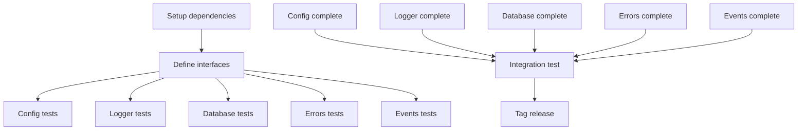

# Implementation Plan: Shared Infrastructure Packages

**Created**: 2025-12-09
**Spec**: [spec.md](./spec.md)

## Technical Context

### Technologies & Tools
- **Config**: [Viper](https://github.com/spf13/viper) v1.18+ - Configuration management
- **Logger**: [Zerolog](https://github.com/rs/zerolog) v1.32+ - Structured logging
- **Database**: [GORM](https://gorm.io/) v1.25+ - ORM for PostgreSQL
- **Database Driver**: [pgx](https://github.com/jackc/pgx) v5 - PostgreSQL driver for GORM
- **Events**: [NATS Go Client](https://github.com/nats-io/nats.go) v1.31+ - NATS Jetstream client
- **Go Version**: 1.23.4
- **Testing**: testify/mock for mock generation

### Design Decisions
- **Viper over os.Getenv**: Hierarchical configuration, multiple sources, type safety
- **Zerolog over log/slog**: Better performance, smaller binary size, middleware-friendly
- **GORM over sqlx**: Developer productivity, migrations support, relationships
- **Typed errors over fmt.Errorf**: API consistency, HTTP status mapping, error codes
- **Interface-based design**: Enables testing with mocks, supports dependency injection

## Project Structure

```
pkg/
├── config/                         # Configuration management (EXISTS)
│   ├── go.mod                     # Module definition (EXISTS)
│   ├── config.go                  # Main config interface and implementation (NEW)
│   ├── config_test.go             # Unit tests (NEW)
│   ├── README.md                  # Package documentation (NEW)
│   └── examples/                  # Usage examples (NEW)
│
├── logger/                         # Structured logging (EXISTS)
│   ├── go.mod                     # Module definition (EXISTS)
│   ├── logger.go                  # Main logger interface and implementation (NEW)
│   ├── context.go                 # Context extraction (request_id, etc.) (NEW)
│   ├── logger_test.go             # Unit tests (NEW)
│   ├── logger_mock.go             # Mock for testing (NEW)
│   ├── README.md                  # Package documentation (NEW)
│   └── examples/                  # Usage examples (NEW)
│
├── database/                       # Database connection (EXISTS)
│   ├── go.mod                     # Module definition (EXISTS)
│   ├── database.go                # Main database interface and connection (NEW)
│   ├── health.go                  # Health check implementation (NEW)
│   ├── retry.go                   # Connection retry logic (NEW)
│   ├── database_test.go           # Unit tests (NEW)
│   ├── database_mock.go           # Mock for testing (NEW)
│   ├── README.md                  # Package documentation (NEW)
│   └── examples/                  # Usage examples (NEW)
│
├── errors/                         # Typed error system (EXISTS)
│   ├── go.mod                     # Module definition (EXISTS)
│   ├── errors.go                  # Error types and constructors (NEW)
│   ├── http.go                    # HTTP serialization (NEW)
│   ├── codes.go                   # Error code constants (NEW)
│   ├── errors_test.go             # Unit tests (NEW)
│   ├── README.md                  # Package documentation (NEW)
│   └── examples/                  # Usage examples (NEW)
│
└── events/                         # NATS event system (EXISTS)
    ├── go.mod                     # Module definition (EXISTS)
    ├── publisher.go               # Event publisher interface and impl (NEW)
    ├── subscriber.go              # Event subscriber interface and impl (NEW)
    ├── event.go                   # Event structure (CloudEvents-like) (NEW)
    ├── connection.go              # NATS connection management (NEW)
    ├── events_test.go             # Unit tests (NEW)
    ├── publisher_mock.go          # Mock for testing (NEW)
    ├── subscriber_mock.go         # Mock for testing (NEW)
    ├── README.md                  # Package documentation (NEW)
    └── examples/                  # Usage examples (NEW)
```

## Phased Implementation

### Phase 1: Setup (Foundation)
**Goal**: Prepare module dependencies and structure

- **T001** [Setup]: Update pkg/config/go.mod with Viper dependency
- **T002** [Setup]: Update pkg/logger/go.mod with Zerolog dependency
- **T003** [Setup]: Update pkg/database/go.mod with GORM and pgx dependencies
- **T004** [Setup]: Update pkg/errors/go.mod (no external deps needed)
- **T005** [Setup]: Update pkg/events/go.mod with NATS Go client dependency
- **T006** [Setup]: Run `go work sync` to sync all modules

**Checkpoint**: All modules have correct dependencies in go.mod

---

### Phase 2: Foundational - Core Interfaces (Blocking Prerequisites)
**Goal**: Define interfaces for all packages

- **T007** [Foundational]: Create pkg/config/config.go with Config interface:
  ```go
  type Config interface {
      Get(key string) interface{}
      GetString(key string) string
      GetInt(key string) int
      GetBool(key string) bool
      GetFloat64(key string) float64
      IsSet(key string) bool
      Validate(requiredKeys []string) error
  }
  ```
- **T008** [Foundational]: Create pkg/logger/logger.go with Logger interface:
  ```go
  type Logger interface {
      Debug(ctx context.Context, msg string, tags Tags)
      Info(ctx context.Context, msg string, tags Tags)
      Warn(ctx context.Context, msg string, tags Tags)
      Error(ctx context.Context, err error, msg string, tags Tags)
      Fatal(ctx context.Context, err error, msg string, tags Tags)
  }
  type Tags map[string]interface{}
  ```
- **T009** [Foundational]: Create pkg/database/database.go with Database interface:
  ```go
  type Database interface {
      Connect(ctx context.Context, config *Config) (*gorm.DB, error)
      HealthCheck(ctx context.Context, db *gorm.DB) error
      Close(db *gorm.DB) error
  }
  ```
- **T010** [Foundational]: Create pkg/errors/errors.go with error types and constructors
- **T011** [Foundational]: Create pkg/events/publisher.go and subscriber.go with interfaces

**Checkpoint**: All package interfaces are defined and compile without errors

---

### Phase 3: User Story 1 - Configuration Management (P1)
**Goal**: Implement Config package with Viper

- **T012** [P][US1]: Write test for loading config from environment variables (test-first)
- **T013** [US1]: Implement ViperConfig struct with New() constructor
- **T014** [US1]: Implement Get(), GetString(), GetInt(), GetBool() methods
- **T015** [P][US1]: Write test for config validation (required keys)
- **T016** [US1]: Implement Validate() method that checks required keys exist
- **T017** [P][US1]: Write test for environment-specific overrides
- **T018** [US1]: Implement AutomaticEnv() and SetEnvPrefix() for env var loading
- **T019** [US1]: Create pkg/config/README.md with usage examples
- **T020** [US1]: Create pkg/config/examples/main.go demonstrating usage

**Checkpoint**: Config package is complete, tested (>80% coverage), and documented

---

### Phase 4: User Story 2 - Structured Logging (P1)
**Goal**: Implement Logger package with Zerolog

- **T021** [P][US2]: Write test for structured logging with tags
- **T022** [US2]: Implement ZerologLogger struct with New() constructor
- **T023** [US2]: Implement Debug(), Info(), Warn(), Error(), Fatal() methods
- **T024** [P][US2]: Write test for log level filtering
- **T025** [US2]: Implement log level configuration from environment
- **T026** [P][US2]: Write test for request_id extraction from context
- **T027** [US2]: Implement pkg/logger/context.go with ExtractRequestID()
- **T028** [US2]: Implement automatic inclusion of request_id, service_name, timestamp
- **T029** [US2]: Create logger_mock.go for testing consumer code
- **T030** [US2]: Create pkg/logger/README.md with usage examples
- **T031** [US2]: Create pkg/logger/examples/main.go demonstrating usage

**Checkpoint**: Logger package is complete, tested (>80% coverage), and documented

---

### Phase 5: User Story 3 - Database Connection (P2)
**Goal**: Implement Database package with GORM

- **T032** [P][US3]: Write test for successful database connection
- **T033** [US3]: Implement Connect() method with GORM initialization
- **T034** [P][US3]: Write test for connection retry logic
- **T035** [US3]: Implement pkg/database/retry.go with exponential backoff (max 5 retries)
- **T036** [P][US3]: Write test for health check query
- **T037** [US3]: Implement HealthCheck() method with SELECT 1 query
- **T038** [P][US3]: Write test for connection pool configuration
- **T039** [US3]: Implement connection pool settings (max open: 25, max idle: 5, max lifetime: 5m)
- **T040** [US3]: Implement slow query logging (threshold: 500ms)
- **T041** [US3]: Implement graceful Close() with context timeout
- **T042** [US3]: Create database_mock.go for testing consumer code
- **T043** [US3]: Create pkg/database/README.md with usage examples
- **T044** [US3]: Create pkg/database/examples/main.go demonstrating usage

**Checkpoint**: Database package is complete, tested (>80% coverage), and documented

---

### Phase 6: User Story 4 - Typed Error System (P2)
**Goal**: Implement Errors package with HTTP mapping

- **T045** [P][US4]: Write tests for all error type constructors
- **T046** [US4]: Implement error constructors: NewBadRequest, NewUnauthorized, NewForbidden, NewNotFound, NewInternalServerError, NewServiceUnavailable
- **T047** [P][US4]: Write test for error serialization to JSON
- **T048** [US4]: Implement pkg/errors/http.go with ToHTTPResponse() method:
  ```go
  type ErrorResponse struct {
      StatusCode int    `json:"status_code"`
      ErrorCode  string `json:"error_code"`
      Message    string `json:"message"`
  }
  ```
- **T049** [P][US4]: Write test for error wrapping with context
- **T050** [US4]: Implement error wrapping with Wrap() method
- **T051** [US4]: Create pkg/errors/codes.go with error code constants
- **T052** [US4]: Create pkg/errors/README.md with usage examples
- **T053** [US4]: Create pkg/errors/examples/main.go demonstrating usage

**Checkpoint**: Errors package is complete, tested (>80% coverage), and documented

---

### Phase 7: User Story 5 - Event Publishing (P3)
**Goal**: Implement Events package with NATS Jetstream

- **T054** [P][US5]: Write test for NATS connection
- **T055** [US5]: Implement pkg/events/connection.go with Connect() and Disconnect()
- **T056** [P][US5]: Write test for event publishing
- **T057** [US5]: Implement Publisher interface and NATSPublisher struct
- **T058** [US5]: Implement Publish() method with PubAck confirmation
- **T059** [P][US5]: Write test for publish retry logic
- **T060** [US5]: Implement retry logic (max 3 retries, exponential backoff)
- **T061** [P][US5]: Write test for event subscription
- **T062** [US5]: Implement Subscriber interface and NATSSubscriber struct
- **T063** [US5]: Implement Subscribe() method with durable consumer
- **T064** [P][US5]: Write test for at-least-once delivery
- **T065** [US5]: Implement automatic ACK/NAK handling
- **T066** [US5]: Create pkg/events/event.go with CloudEvents-like structure:
  ```go
  type Event struct {
      ID             string                 `json:"id"`
      Type           string                 `json:"type"`
      Source         string                 `json:"source"`
      OrganizationID string                 `json:"organization_id"`
      Timestamp      time.Time              `json:"timestamp"`
      Data           map[string]interface{} `json:"data"`
  }
  ```
- **T067** [US5]: Create publisher_mock.go and subscriber_mock.go for testing
- **T068** [US5]: Create pkg/events/README.md with usage examples
- **T069** [US5]: Create pkg/events/examples/main.go demonstrating pub/sub

**Checkpoint**: Events package is complete, tested (>80% coverage), and documented

---

### Phase 8: Polish (Cross-Cutting Concerns)
**Goal**: Integration testing, documentation, and optimization

- **T070** [Polish]: Create integration test that uses all packages together (config → logger → database → events)
- **T071** [Polish]: Run golangci-lint on all packages, fix issues
- **T072** [Polish]: Generate test coverage reports for all packages, ensure >80%
- **T073** [Polish]: Create pkg/README.md overview document explaining all packages
- **T074** [Polish]: Update main README.md with links to shared packages
- **T075** [Polish]: Add GoDoc comments to all exported types and functions
- **T076** [Polish]: Create architectural decision records (ADRs) for key decisions (why Viper, why Zerolog, etc.)
- **T077** [Polish]: Performance testing for database connection pool under load
- **T078** [Polish]: Performance testing for logger throughput
- **T079** [Polish]: Update go.work to ensure all packages are included
- **T080** [Polish]: Tag release v0.1.0 for shared packages milestone

**Checkpoint**: All packages production-ready with documentation and tests

---

## Task Dependencies



**Critical Path**: T001 → T007 → All US implementations → T070 → T080

## Execution Strategy

### Recommended Order (with team of 3)
**Week 1**:
- Day 1-2: Phase 1 + Phase 2 (Setup + Interfaces) - **Full team**
- Day 3-5: Phase 3 + Phase 4 + Phase 5 (Config, Logger, Database) - **Parallel: Dev A = Config, Dev B = Logger, Dev C = Database**

**Week 2**:
- Day 1-2: Phase 6 + Phase 7 (Errors, Events) - **Parallel: Dev A+B = Events, Dev C = Errors**
- Day 3-5: Phase 8 (Polish, integration, documentation) - **Full team**

### Single Developer Timeline
- **Day 1**: Phase 1 + Phase 2 (Setup + Interfaces)
- **Day 2-3**: Phase 3 (Config package)
- **Day 4-5**: Phase 4 (Logger package)
- **Day 6-7**: Phase 5 (Database package)
- **Day 8-9**: Phase 6 (Errors package)
- **Day 10-11**: Phase 7 (Events package)
- **Day 12-14**: Phase 8 (Polish)

**Total: 10-14 days single developer, 7-10 days with 3 developers**

## Testing Strategy

### Unit Testing (Test-First Approach)
- Write test BEFORE implementation for all public methods
- Use testify/assert for assertions
- Use testify/mock for mocking dependencies
- Target: >80% coverage per package

### Integration Testing
- Test config → logger → database flow
- Test database connection with real PostgreSQL (docker-compose)
- Test NATS publish/subscribe with real NATS (docker-compose)
- Test error serialization in HTTP handler

### Manual Testing Checklist
- [ ] Config loads from .env file
- [ ] Config loads from environment variables (env vars override .env)
- [ ] Logger outputs valid JSON to stdout
- [ ] Logger respects LOG_LEVEL environment variable
- [ ] Database connects to PostgreSQL and health check passes
- [ ] Database retry works when PostgreSQL is temporarily down
- [ ] Errors serialize to correct HTTP status codes
- [ ] Events publish to NATS and subscriber receives them
- [ ] Mocks work correctly in consumer tests

## Risks & Mitigations

| Risk | Impact | Mitigation |
|------|--------|------------|
| GORM performance issues at scale | Medium | Benchmark with 10k concurrent queries, tune pool settings |
| NATS Jetstream not available locally | Medium | Document docker-compose setup, provide fallback stub |
| Breaking changes in dependencies | Low | Pin exact versions in go.mod, update cautiously |
| Circular dependencies between packages | High | Strict dependency order: errors → config → logger → database/events |
| Mock generation complexity | Low | Use testify/mock, provide examples in docs |

## Rollout Plan

1. **PR 1**: Foundation (Phase 1 + Phase 2) - Interfaces and dependencies
2. **PR 2**: Config + Logger (Phase 3 + Phase 4) - Core utilities
3. **PR 3**: Database + Errors (Phase 5 + Phase 6) - Data and error handling
4. **PR 4**: Events (Phase 7) - Event system
5. **PR 5**: Polish + Integration (Phase 8) - Final touches

Each PR independently reviewable, builds on previous PRs.

---

**Estimated Effort**: 10-14 days (single developer), 7-10 days (team of 3)
**Complexity**: Medium-High
**Blockers**: Task 3 (need local infrastructure for integration tests)
**Enables**: All service development (Tasks 5-9)
