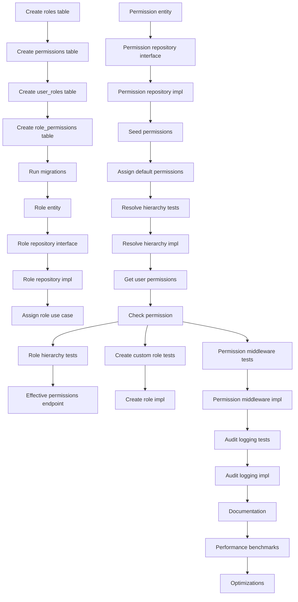

# Implementation Plan: Role-Based Access Control (RBAC)

**Created**: 2025-12-09
**Spec**: [spec.md](./spec.md)

## Technical Context

### Technologies & Tools
- **Go**: 1.23.4 with Clean Architecture
- **Database**: PostgreSQL 16 with GORM (roles, permissions tables)
- **Caching**: Redis for permission caching (5-minute TTL)
- **gRPC**: For permission validation service (golang.org/x/net/grpc)
- **JWT**: User roles included in JWT claims
- **Testing**: testify/mock for unit tests

### Design Decisions
- **Permission format**: "service:resource:action" (e.g., "catalog:products:read", "ddmrp:buffers:write")
- **Role hierarchy**: Admin > Manager > Analyst > Viewer (inheritance via parent_role_id)
- **Permission inheritance**: Roles inherit all permissions from parent roles recursively
- **Caching strategy**: Cache user permissions in Redis (key: "user:{user_id}:permissions", TTL: 5 minutes)
- **System vs Organization roles**: System roles (predefined, null organization_id) apply to all tenants. Organization roles (custom, specific organization_id) override system roles.
- **Wildcard permissions**: Admin role has "*:*:*" wildcard permission (matches everything)
- **Synchronous validation**: gRPC CheckPermission endpoint returns boolean in <10ms (p95) with caching
- **Audit logging**: All permission checks logged for compliance (service, user_id, permission, result, timestamp)

## Project Structure

```
services/auth-service/
├── internal/
│   ├── core/
│   │   ├── domain/
│   │   │   ├── role.go              # Role entity (NEW)
│   │   │   ├── permission.go        # Permission entity (NEW)
│   │   │   ├── user_role.go         # UserRole join entity (NEW)
│   │   │   └── role_permission.go   # RolePermission join entity (NEW)
│   │   │
│   │   ├── usecases/
│   │   │   ├── rbac/
│   │   │   │   ├── check_permission.go      # Main permission check logic (NEW)
│   │   │   │   ├── batch_check.go           # Batch permission check (NEW)
│   │   │   │   ├── get_user_permissions.go  # Get all user permissions (NEW)
│   │   │   │   └── resolve_inheritance.go   # Resolve role hierarchy (NEW)
│   │   │   │
│   │   │   ├── role/
│   │   │   │   ├── create_role.go           # Create custom role (NEW)
│   │   │   │   ├── update_role.go           # Update role permissions (NEW)
│   │   │   │   ├── delete_role.go           # Delete role (NEW)
│   │   │   │   └── assign_role.go           # Assign role to user (NEW)
│   │   │   │
│   │   │   └── permission/
│   │   │       ├── list_permissions.go      # List available permissions (NEW)
│   │   │       └── seed_permissions.go      # Seed system permissions (NEW)
│   │   │
│   │   └── providers/
│   │       ├── role_repository.go           # Role data access interface (NEW)
│   │       ├── permission_repository.go     # Permission data access interface (NEW)
│   │       └── permission_cache.go          # Cache interface (NEW)
│   │
│   └── infrastructure/
│       ├── adapters/
│       │   └── cache/
│       │       ├── redis_permission_cache.go  # Redis permission cache (NEW)
│       │       └── cache_test.go              # (NEW)
│       │
│       ├── repositories/
│       │   ├── role_repository.go             # GORM implementation (NEW)
│       │   ├── permission_repository.go       # GORM implementation (NEW)
│       │   └── user_role_repository.go        # GORM implementation (NEW)
│       │
│       ├── entrypoints/
│       │   └── http/
│       │       ├── handlers/
│       │       │   ├── role_handler.go        # Role management endpoints (NEW)
│       │       │   └── permission_handler.go  # Permission endpoints (NEW)
│       │       │
│       │       └── middleware/
│       │           └── permission.go          # Permission check middleware (NEW)
│       │
│       └── persistence/
│           └── migrations/
│               ├── 006_create_roles.sql              # (NEW)
│               ├── 007_create_permissions.sql        # (NEW)
│               ├── 008_create_user_roles.sql         # (NEW)
│               ├── 009_create_role_permissions.sql   # (NEW)
│               └── 010_seed_default_roles.sql        # (NEW)
│
├── scripts/
│   └── seed_permissions.go            # Script to seed all permissions (NEW)
│
└── docs/
    ├── RBAC_DESIGN.md                 # RBAC architecture documentation (NEW)
    └── PERMISSIONS.md                 # Complete list of permissions (NEW)
```

## Phased Implementation

### Phase 1: Setup (Foundation)
**Goal**: Define database schema for RBAC

- **T001** [Setup]: Create migration `006_create_roles.sql`:
  ```sql
  CREATE TABLE roles (
      id UUID PRIMARY KEY DEFAULT gen_random_uuid(),
      name VARCHAR(100) NOT NULL,
      description TEXT,
      organization_id UUID REFERENCES organizations(id),
      parent_role_id UUID REFERENCES roles(id),
      is_system BOOLEAN NOT NULL DEFAULT false,
      created_at TIMESTAMP NOT NULL DEFAULT NOW(),
      updated_at TIMESTAMP NOT NULL DEFAULT NOW(),
      UNIQUE(name, organization_id)
  );
  CREATE INDEX idx_roles_organization_id ON roles(organization_id);
  CREATE INDEX idx_roles_parent_role_id ON roles(parent_role_id);
  ```
- **T002** [Setup]: Create migration `007_create_permissions.sql`:
  ```sql
  CREATE TABLE permissions (
      id UUID PRIMARY KEY DEFAULT gen_random_uuid(),
      code VARCHAR(255) NOT NULL UNIQUE,
      description TEXT,
      service VARCHAR(50) NOT NULL,
      resource VARCHAR(100) NOT NULL,
      action VARCHAR(50) NOT NULL,
      created_at TIMESTAMP NOT NULL DEFAULT NOW()
  );
  CREATE INDEX idx_permissions_service ON permissions(service);
  CREATE INDEX idx_permissions_code ON permissions(code);
  ```
- **T003** [Setup]: Create migration `008_create_user_roles.sql`:
  ```sql
  CREATE TABLE user_roles (
      id UUID PRIMARY KEY DEFAULT gen_random_uuid(),
      user_id UUID NOT NULL REFERENCES users(id) ON DELETE CASCADE,
      role_id UUID NOT NULL REFERENCES roles(id) ON DELETE CASCADE,
      assigned_at TIMESTAMP NOT NULL DEFAULT NOW(),
      assigned_by UUID REFERENCES users(id),
      UNIQUE(user_id, role_id)
  );
  CREATE INDEX idx_user_roles_user_id ON user_roles(user_id);
  CREATE INDEX idx_user_roles_role_id ON user_roles(role_id);
  ```
- **T004** [Setup]: Create migration `009_create_role_permissions.sql`:
  ```sql
  CREATE TABLE role_permissions (
      role_id UUID NOT NULL REFERENCES roles(id) ON DELETE CASCADE,
      permission_id UUID NOT NULL REFERENCES permissions(id) ON DELETE CASCADE,
      granted_at TIMESTAMP NOT NULL DEFAULT NOW(),
      PRIMARY KEY (role_id, permission_id)
  );
  CREATE INDEX idx_role_permissions_role_id ON role_permissions(role_id);
  ```
- **T005** [Setup]: Run migrations on local database and verify schema

**Checkpoint**: RBAC database schema created with all tables and indexes

---

### Phase 2: Foundational - Domain Entities and Interfaces (Blocking Prerequisites)
**Goal**: Define core domain models and repository interfaces

- **T006** [Foundational]: Create domain entity `internal/core/domain/role.go`:
  ```go
  type Role struct {
      ID             string
      Name           string
      Description    string
      OrganizationID *string  // null for system roles
      ParentRoleID   *string  // for hierarchy
      IsSystem       bool
      Permissions    []Permission
      CreatedAt      time.Time
      UpdatedAt      time.Time
  }
  ```
- **T007** [Foundational]: Create domain entity `internal/core/domain/permission.go`:
  ```go
  type Permission struct {
      ID          string
      Code        string  // "catalog:products:read"
      Description string
      Service     string  // "catalog"
      Resource    string  // "products"
      Action      string  // "read"
      CreatedAt   time.Time
  }
  ```
- **T008** [Foundational]: Create domain entity `internal/core/domain/user_role.go`
- **T009** [Foundational]: Create repository interface `internal/core/providers/role_repository.go`:
  ```go
  type RoleRepository interface {
      Create(ctx context.Context, role *domain.Role) error
      GetByID(ctx context.Context, roleID string) (*domain.Role, error)
      GetByName(ctx context.Context, name string, orgID *string) (*domain.Role, error)
      GetWithPermissions(ctx context.Context, roleID string) (*domain.Role, error)
      Update(ctx context.Context, role *domain.Role) error
      Delete(ctx context.Context, roleID string) error
      List(ctx context.Context, orgID *string) ([]*domain.Role, error)
      GetUserRoles(ctx context.Context, userID string) ([]*domain.Role, error)
  }
  ```
- **T010** [Foundational]: Create repository interface `internal/core/providers/permission_repository.go`:
  ```go
  type PermissionRepository interface {
      Create(ctx context.Context, permission *domain.Permission) error
      GetByCode(ctx context.Context, code string) (*domain.Permission, error)
      List(ctx context.Context) ([]*domain.Permission, error)
      GetByService(ctx context.Context, service string) ([]*domain.Permission, error)
      GetRolePermissions(ctx context.Context, roleID string) ([]*domain.Permission, error)
      AssignPermissionsToRole(ctx context.Context, roleID string, permissionIDs []string) error
      RemovePermissionsFromRole(ctx context.Context, roleID string, permissionIDs []string) error
  }
  ```
- **T011** [Foundational]: Create cache interface `internal/core/providers/permission_cache.go`:
  ```go
  type PermissionCache interface {
      GetUserPermissions(ctx context.Context, userID string) ([]string, error)
      SetUserPermissions(ctx context.Context, userID string, permissions []string, ttl time.Duration) error
      InvalidateUserPermissions(ctx context.Context, userID string) error
  }
  ```

**Checkpoint**: All RBAC interfaces and domain entities defined

---

### Phase 3: User Story 1 - Basic Role Assignment (P1)
**Goal**: Implement role assignment and basic permission checks

- **T012** [P][US1]: Write test for role repository CRUD operations
- **T013** [US1]: Implement `internal/infrastructure/repositories/role_repository.go` with GORM
- **T014** [P][US1]: Write test for permission repository operations
- **T015** [US1]: Implement `internal/infrastructure/repositories/permission_repository.go` with GORM
- **T016** [P][US1]: Write test for user role assignment
- **T017** [US1]: Implement `internal/infrastructure/repositories/user_role_repository.go`:
  - AssignRoleToUser(ctx, userID, roleID, assignedBy)
  - RemoveRoleFromUser(ctx, userID, roleID)
  - GetUserRoles(ctx, userID)
- **T018** [US1]: Create migration `010_seed_default_roles.sql`:
  ```sql
  -- Insert system roles
  INSERT INTO roles (id, name, description, is_system, parent_role_id) VALUES
  ('role-viewer', 'Viewer', 'Read-only access to all services', true, NULL),
  ('role-analyst', 'Analyst', 'Read all + write analytics', true, 'role-viewer'),
  ('role-manager', 'Manager', 'Manage catalog, DDMRP, execution', true, 'role-analyst'),
  ('role-admin', 'Admin', 'Full system access', true, 'role-manager');
  ```
- **T019** [P][US1]: Write test for assign role use case
- **T020** [US1]: Implement `internal/core/usecases/role/assign_role.go`:
  - Validate user exists
  - Validate role exists
  - Check admin permissions (only admins can assign roles)
  - Assign role to user
  - Invalidate user permission cache
  - Publish "user.role_assigned" event
- **T021** [US1]: Implement HTTP handler `POST /api/v1/roles/{roleId}/users/{userId}`
- **T022** [P][US1]: Write test for list user roles endpoint
- **T023** [US1]: Implement HTTP handler `GET /api/v1/users/{userId}/roles`
- **T024** [P][US1]: Write integration test: Assign Admin role, verify user has admin permissions

**Checkpoint**: Roles can be assigned to users and queried

---

### Phase 4: User Story 2 - Permission-Based Access Control (P1)
**Goal**: Implement permission checking with caching

- **T025** [P][US2]: Write test for permission seeding script
- **T026** [US2]: Create `scripts/seed_permissions.go` to generate all permissions:
  ```go
  // Auth service permissions
  "auth:users:read", "auth:users:write", "auth:users:delete"
  "auth:roles:read", "auth:roles:write", "auth:roles:delete"

  // Catalog service permissions
  "catalog:products:read", "catalog:products:write", "catalog:products:delete"
  "catalog:suppliers:read", "catalog:suppliers:write", "catalog:suppliers:delete"
  "catalog:profiles:read", "catalog:profiles:write", "catalog:profiles:delete"

  // DDMRP service permissions
  "ddmrp:buffers:read", "ddmrp:buffers:write", "ddmrp:buffers:delete"
  "ddmrp:calculations:read", "ddmrp:calculations:execute"

  // Execution service permissions
  "execution:orders:read", "execution:orders:write", "execution:orders:delete"
  "execution:schedules:read", "execution:schedules:write"

  // Analytics service permissions
  "analytics:reports:read", "analytics:reports:write"
  "analytics:dashboards:read", "analytics:dashboards:write"

  // AI Agent service permissions
  "ai_agent:queries:read", "ai_agent:queries:write"
  ```
- **T027** [US2]: Run seed script to populate permissions table
- **T028** [US2]: Create script to assign default permissions to system roles:
  - Viewer: All ":read" permissions
  - Analyst: Viewer + "analytics:*:write"
  - Manager: Analyst + "catalog:*:write" + "ddmrp:*:write" + "execution:*:write"
  - Admin: "*:*:*" (wildcard)
- **T029** [P][US2]: Write test for Redis permission cache
- **T030** [US2]: Implement `internal/infrastructure/adapters/cache/redis_permission_cache.go`:
  - GetUserPermissions(userID) -> []string
  - SetUserPermissions(userID, permissions, 5 minutes)
  - InvalidateUserPermissions(userID)
  - Use Redis SET with JSON encoding
- **T031** [P][US2]: Write test for resolve role hierarchy
- **T032** [US2]: Implement `internal/core/usecases/rbac/resolve_inheritance.go`:
  - Recursively traverse parent_role_id to get all ancestor roles
  - Collect permissions from all roles in hierarchy
  - Deduplicate permissions
  - Return flattened list
- **T033** [P][US2]: Write test for get user permissions use case
- **T034** [US2]: Implement `internal/core/usecases/rbac/get_user_permissions.go`:
  - Check cache first
  - If miss: fetch user roles from database
  - Resolve role hierarchy for each role
  - Collect all permissions from roles
  - Check for wildcard permission "*:*:*"
  - Cache result (5-minute TTL)
  - Return permission codes
- **T035** [P][US2]: Write test for check permission use case
- **T036** [US2]: Implement `internal/core/usecases/rbac/check_permission.go`:
  ```go
  func CheckPermission(ctx context.Context, userID string, permission string) (bool, error) {
      // Get all user permissions (from cache or database)
      userPermissions := GetUserPermissions(ctx, userID)

      // Check for wildcard admin permission
      if contains(userPermissions, "*:*:*") {
          return true, nil
      }

      // Check for exact match
      if contains(userPermissions, permission) {
          return true, nil
      }

      // Check for service-level wildcard (e.g., "catalog:*:*")
      // Check for resource-level wildcard (e.g., "catalog:products:*")
      // ... wildcard matching logic

      return false, nil
  }
  ```
- **T037** [US2]: Implement HTTP handler `POST /api/v1/permissions/check` (for debugging)
- **T038** [P][US2]: Write test for batch check permissions
- **T039** [US2]: Implement `internal/core/usecases/rbac/batch_check.go`:
  - Accept array of permissions
  - Get user permissions once
  - Check each permission against user permissions
  - Return array of booleans
- **T040** [US2]: Implement HTTP handler `POST /api/v1/permissions/batch-check`

**Checkpoint**: Permission checking works with caching and hierarchy resolution

---

### Phase 5: User Story 3 - Role Hierarchy (P2)
**Goal**: Implement and test role inheritance

- **T041** [P][US3]: Write test for role hierarchy traversal
- **T042** [US3]: Verify `resolve_inheritance.go` handles circular references (error)
- **T043** [US3]: Verify `resolve_inheritance.go` handles deep hierarchy (e.g., 5 levels)
- **T044** [P][US3]: Write test for permission aggregation with inheritance
- **T045** [US3]: Create test scenario:
  - Viewer has ["catalog:products:read"]
  - Analyst inherits Viewer + has ["analytics:reports:write"]
  - Manager inherits Analyst + has ["catalog:products:write"]
  - Admin inherits Manager + has ["*:*:*"]
  - Verify Admin has all 4 permission sets
- **T046** [P][US3]: Write integration test for role hierarchy
- **T047** [US3]: Create HTTP endpoint `GET /api/v1/roles/{roleId}/effective-permissions` to show inherited permissions
- **T048** [US3]: Update JWT token generation to include role names (not all permissions, too large)
- **T049** [US3]: Document role hierarchy in `docs/RBAC_DESIGN.md`

**Checkpoint**: Role hierarchy works correctly with inheritance

---

### Phase 6: Custom Role Management (Supporting P1-P2)
**Goal**: Allow organizations to create custom roles

- **T050** [P]: Write test for create custom role use case
- **T051**: Implement `internal/core/usecases/role/create_role.go`:
  - Validate role name unique within organization
  - Validate parent_role_id exists (if provided)
  - Check admin permissions
  - Create role with organization_id
  - Assign permissions to role
  - Return created role
- **T052**: Implement HTTP handler `POST /api/v1/roles`
- **T053** [P]: Write test for update role permissions
- **T054**: Implement `internal/core/usecases/role/update_role.go`:
  - Validate role exists and belongs to organization
  - Check admin permissions
  - Update role permissions (replace existing)
  - Invalidate cache for all users with this role
  - Return updated role
- **T055**: Implement HTTP handler `PUT /api/v1/roles/{roleId}/permissions`
- **T056** [P]: Write test for delete role (soft delete)
- **T057**: Implement `internal/core/usecases/role/delete_role.go`:
  - Validate role not system role (cannot delete predefined roles)
  - Check admin permissions
  - Remove all user-role assignments
  - Delete role
  - Invalidate cache for affected users
- **T058**: Implement HTTP handler `DELETE /api/v1/roles/{roleId}`
- **T059**: Implement HTTP handler `GET /api/v1/roles` (list all roles for organization)

**Checkpoint**: Organizations can create and manage custom roles

---

### Phase 7: Permission Middleware (HTTP)
**Goal**: Enforce permissions at HTTP layer

- **T060** [P]: Write test for permission middleware
- **T061**: Implement `internal/infrastructure/entrypoints/http/middleware/permission.go`:
  ```go
  func RequirePermission(permission string) gin.HandlerFunc {
      return func(c *gin.Context) {
          userID := c.GetString("user_id")  // from auth middleware

          allowed, err := checkPermissionUseCase.Execute(c.Request.Context(), userID, permission)
          if err != nil {
              c.JSON(500, gin.H{"error": "permission check failed"})
              c.Abort()
              return
          }

          if !allowed {
              logger.Warn(c, "Permission denied", logs.Tags{
                  "user_id": userID,
                  "permission": permission,
              })
              c.JSON(403, gin.H{"error": "permission denied"})
              c.Abort()
              return
          }

          c.Next()
      }
  }
  ```
- **T062**: Apply permission middleware to test endpoint
- **T063** [P]: Write integration test: User without permission gets 403
- **T064**: Update router to apply permissions to role management endpoints:
  - POST /api/v1/roles → RequirePermission("auth:roles:write")
  - DELETE /api/v1/roles/:id → RequirePermission("auth:roles:delete")
  - POST /api/v1/roles/:id/users/:userId → RequirePermission("auth:roles:write")
- **T065**: Document permission requirements for all endpoints in OpenAPI spec

**Checkpoint**: HTTP endpoints enforce permission checks

---

### Phase 8: Audit Logging (Cross-Cutting)
**Goal**: Log all permission checks for compliance

- **T066** [P]: Write test for audit log creation
- **T067**: Create audit log table migration (optional - can use structured logs):
  ```sql
  CREATE TABLE permission_audit_logs (
      id UUID PRIMARY KEY DEFAULT gen_random_uuid(),
      user_id UUID NOT NULL,
      organization_id UUID NOT NULL,
      permission VARCHAR(255) NOT NULL,
      allowed BOOLEAN NOT NULL,
      service VARCHAR(50),
      endpoint VARCHAR(255),
      ip_address VARCHAR(50),
      created_at TIMESTAMP NOT NULL DEFAULT NOW()
  );
  CREATE INDEX idx_audit_logs_user_id ON permission_audit_logs(user_id);
  CREATE INDEX idx_audit_logs_created_at ON permission_audit_logs(created_at);
  ```
- **T068**: Implement audit logging in `check_permission.go`:
  - Log every permission check (success and failure)
  - Include user_id, permission, result, service, endpoint, timestamp
  - Use structured logger (not database table for performance)
- **T069**: Implement audit log query endpoint `GET /api/v1/audit/permissions` (admin only):
  - Filter by user_id, date range, permission
  - Pagination support
  - Export to CSV for compliance
- **T070**: Add metrics for permission checks:
  - Counter: permission_checks_total (labels: permission, result)
  - Histogram: permission_check_duration_seconds

**Checkpoint**: All permission checks are audited and queryable

---

### Phase 9: Polish (Documentation and Optimization)
**Goal**: Optimize performance, complete documentation

- **T071** [Polish]: Document all permissions in `docs/PERMISSIONS.md`:
  - List all services
  - List all permissions per service
  - Describe default role permissions
  - Provide examples
- **T072** [Polish]: Create RBAC architecture diagram showing role hierarchy
- **T073** [Polish]: Update main README with RBAC overview
- **T074** [Polish]: Benchmark permission check latency:
  - Target: <10ms (p95) with cache hit
  - Target: <50ms (p95) with cache miss
- **T075** [Polish]: Load test: 10,000 concurrent permission checks
- **T076** [Polish]: Optimize cache key structure for faster lookups
- **T077** [Polish]: Implement cache warming on server startup (preload admin permissions)
- **T078** [Polish]: Add cache invalidation on role/permission changes:
  - When role permissions updated → invalidate all users with that role
  - When user role assigned/removed → invalidate that user
  - When permission deleted → invalidate all roles with that permission
- **T079** [Polish]: Handle edge case: Role deleted while users have it assigned
  - Remove user-role assignments on role deletion
  - Invalidate affected user caches
- **T080** [Polish]: Handle edge case: Circular role hierarchy prevention
  - Check for cycles when setting parent_role_id
  - Return error if cycle detected
- **T081** [Polish]: Implement wildcard permission matching:
  - "catalog:*:*" matches any catalog permission
  - "catalog:products:*" matches any product action
  - "*:*:read" matches all read permissions
- **T082** [Polish]: Create Postman collection for RBAC API testing
- **T083** [Polish]: Run golangci-lint and fix issues
- **T084** [Polish]: Generate test coverage report, ensure >80%
- **T085** [Polish]: Performance optimization: Batch load user roles in single query
- **T086** [Polish]: Add health check for Redis cache availability

**Checkpoint**: RBAC system production-ready with documentation and optimizations

---

## Task Dependencies



**Critical Path**: T001 → T005 → T013 → T026 → T036 → T061 → T071

## Execution Strategy

### Recommended Order (Single Developer)
**Week 1: Foundation**
- Day 1: Phase 1-2 (Setup + Foundational - schema and interfaces)
- Day 2-3: Phase 3 (Basic role assignment)
- Day 4-5: Phase 4 (Permission checking with caching)

**Week 2: Advanced Features**
- Day 1-2: Phase 5 (Role hierarchy)
- Day 3: Phase 6 (Custom role management)
- Day 4: Phase 7 (Permission middleware)
- Day 5: Phase 8 (Audit logging)

**Week 3: Polish**
- Day 1-2: Phase 9 (Documentation, optimization, testing)

### Team of 2 Developers
**Week 1-2**
- Dev A: Phase 1-4 (Foundation + basic permission checking)
- Dev B: Phase 5-6 (Role hierarchy + custom roles)

**Week 2-3**
- Dev A: Phase 7-8 (Middleware + audit logging)
- Dev B: Phase 9 (Polish and optimization)

**Total: 10-12 days single developer, 7-9 days with 2 developers**

## Testing Strategy

### Unit Testing
- Mock database repositories for use case tests
- Mock cache for permission check tests
- Test role hierarchy traversal with various depths
- Test circular reference detection
- Test wildcard permission matching
- Target: >80% coverage

### Integration Testing
- Test full permission check flow with PostgreSQL and Redis
- Test role assignment and verification
- Test cache hit/miss scenarios
- Test permission cache invalidation
- Test role hierarchy with 4 levels (Admin → Manager → Analyst → Viewer)

### Performance Testing
- Benchmark permission check with cache hit: <10ms (p95)
- Benchmark permission check with cache miss: <50ms (p95)
- Load test: 10,000 concurrent permission checks
- Verify cache hit rate >95% in normal operation

### Manual Testing Checklist
- [ ] Admin user can perform all actions
- [ ] Viewer user can only read, cannot write or delete
- [ ] Manager user can manage catalog and DDMRP, but not assign roles
- [ ] User without permission gets 403 Forbidden
- [ ] Permission cache works (check Redis keys)
- [ ] Cache invalidates when role permissions change
- [ ] Role hierarchy works (Analyst has Viewer permissions + own permissions)
- [ ] Custom roles can be created per organization
- [ ] Audit logs show all permission checks
- [ ] System roles cannot be deleted

## Risks & Mitigations

| Risk | Impact | Mitigation |
|------|--------|------------|
| Permission cache stale after role changes | High | Invalidate cache on role/permission updates, implement cache version |
| Performance degradation from complex hierarchy | Medium | Limit hierarchy depth to 5 levels, cache resolved permissions |
| Cache unavailable (Redis down) | Medium | Fall back to database query, log warning, continue operation |
| Circular role hierarchy | Low | Validate parent_role_id on creation, prevent cycles |
| Permission explosion (too many permissions) | Low | Use wildcard permissions for admin, consolidate similar permissions |
| Audit log table growth | Low | Partition by month, archive old logs, use structured logging instead |

## Rollout Plan

1. **PR 1**: Foundation (Phase 1-2) - Database schema, domain entities, interfaces
2. **PR 2**: Basic RBAC (Phase 3) - Role assignment, repository implementations
3. **PR 3**: Permission Checking (Phase 4) - Permission validation with caching
4. **PR 4**: Role Hierarchy (Phase 5) - Inheritance and effective permissions
5. **PR 5**: Custom Roles (Phase 6) - Organization-specific role management
6. **PR 6**: Enforcement (Phase 7) - HTTP middleware and endpoint protection
7. **PR 7**: Audit (Phase 8) - Audit logging and metrics
8. **PR 8**: Polish (Phase 9) - Documentation and optimization

Each PR independently deployable to staging.

---

**Estimated Effort**: 10-12 days (single developer), 7-9 days (team of 2)
**Complexity**: Medium-High (caching + hierarchy + performance requirements)
**Blockers**: Task 5 (Auth service must exist first)
**Enables**: Task 7 (gRPC CheckPermission endpoint), Task 9 (Catalog service permission enforcement)
