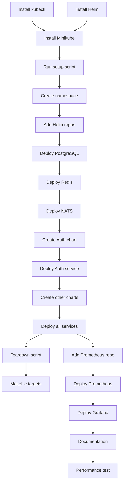

# Implementation Plan: Kubernetes Development Cluster

**Created**: 2025-12-09
**Spec**: [spec.md](./spec.md)

## Technical Context

### Technologies & Tools
- **Kubernetes**: 1.28+ (Minikube or kind for local development)
- **Helm**: 3.13+ for package management
- **Ingress**: NGINX Ingress Controller
- **Infrastructure Charts**: Bitnami PostgreSQL, Bitnami Redis, NATS Helm chart
- **Monitoring**: Prometheus + Grafana (optional)
- **Container Runtime**: Docker (via Minikube/kind)
- **DNS**: Local DNS (*.giia.local) via /etc/hosts or CoreDNS

### Design Decisions
- **Minikube vs kind**: Use Minikube for easier setup and built-in addons, kind as alternative for CI/CD
- **Namespace strategy**: Single namespace `giia-dev` for local development, separate namespaces for staging/prod
- **Resource limits**: Set requests and limits to prevent resource exhaustion
- **ConfigMap vs Secret**: Non-sensitive config in ConfigMap, sensitive data (passwords, tokens) in Secrets
- **Service discovery**: Use Kubernetes DNS (service-name.namespace.svc.cluster.local)
- **Ingress routing**: Single ingress controller routing to all services via path-based routing
- **Persistent storage**: Use local storage class for development (emptyDir for ephemeral)
- **Rolling updates**: MaxUnavailable=1, MaxSurge=1 for zero-downtime deployments
- **Health checks**: Readiness probes for traffic routing, liveness probes for restarts

## Project Structure

```
k8s/
├── infrastructure/                      # Infrastructure Helm charts
│   ├── postgresql/
│   │   ├── values-dev.yaml             # Development overrides (NEW)
│   │   └── values-prod.yaml            # Production values (NEW)
│   │
│   ├── redis/
│   │   ├── values-dev.yaml             # (NEW)
│   │   └── values-prod.yaml            # (NEW)
│   │
│   └── nats/
│       ├── values-dev.yaml             # (NEW)
│       └── values-prod.yaml            # (NEW)
│
├── services/                           # Service Helm charts
│   ├── auth-service/
│   │   ├── Chart.yaml                  # Helm chart metadata (NEW)
│   │   ├── values.yaml                 # Default values (NEW)
│   │   ├── values-dev.yaml             # Development overrides (NEW)
│   │   ├── values-prod.yaml            # Production overrides (NEW)
│   │   └── templates/
│   │       ├── deployment.yaml         # Deployment manifest (NEW)
│   │       ├── service.yaml            # Service manifest (NEW)
│   │       ├── ingress.yaml            # Ingress rules (NEW)
│   │       ├── configmap.yaml          # ConfigMap (NEW)
│   │       ├── secret.yaml             # Secret (NEW)
│   │       └── hpa.yaml                # Horizontal Pod Autoscaler (optional)
│   │
│   ├── catalog-service/
│   │   └── ...                         # Similar structure
│   │
│   ├── ddmrp-engine-service/
│   ├── execution-service/
│   ├── analytics-service/
│   └── ai-agent-service/
│
├── base/                               # Base manifests
│   ├── namespace.yaml                  # Namespace definition (NEW)
│   ├── shared-configmap.yaml           # Shared configuration (NEW)
│   └── shared-secrets.yaml             # Shared secrets template (NEW)
│
└── scripts/
    ├── setup-cluster.sh                # Initialize cluster (NEW)
    ├── deploy-infrastructure.sh        # Deploy PostgreSQL, Redis, NATS (NEW)
    ├── deploy-services.sh              # Deploy all microservices (NEW)
    ├── teardown-cluster.sh             # Destroy cluster (NEW)
    └── update-hosts.sh                 # Update /etc/hosts for local DNS (NEW)

Makefile                                # Automation commands (UPDATE)
README_K8S.md                           # Kubernetes documentation (NEW)
```

## Phased Implementation

### Phase 1: Setup (Foundation)
**Goal**: Install tools and initialize local Kubernetes cluster

- **T001** [Setup]: Install kubectl (if not already installed):
  ```bash
  # macOS
  brew install kubectl

  # Linux
  curl -LO "https://dl.k8s.io/release/$(curl -L -s https://dl.k8s.io/release/stable.txt)/bin/linux/amd64/kubectl"
  sudo install -o root -g root -m 0755 kubectl /usr/local/bin/kubectl

  # Windows
  choco install kubernetes-cli
  ```
- **T002** [Setup]: Install Helm 3:
  ```bash
  # macOS
  brew install helm

  # Linux
  curl https://raw.githubusercontent.com/helm/helm/main/scripts/get-helm-3 | bash

  # Windows
  choco install kubernetes-helm
  ```
- **T003** [Setup]: Install Minikube:
  ```bash
  # macOS
  brew install minikube

  # Linux
  curl -LO https://storage.googleapis.com/minikube/releases/latest/minikube-linux-amd64
  sudo install minikube-linux-amd64 /usr/local/bin/minikube

  # Windows
  choco install minikube
  ```
- **T004** [Setup]: Verify Docker is running (required for Minikube)
- **T005** [Setup]: Create `scripts/setup-cluster.sh`:
  ```bash
  #!/bin/bash
  set -e

  echo "Creating Minikube cluster..."
  minikube start \
    --cpus=4 \
    --memory=8192 \
    --disk-size=20g \
    --driver=docker \
    --kubernetes-version=v1.28.0

  echo "Enabling addons..."
  minikube addons enable ingress
  minikube addons enable metrics-server

  echo "Cluster ready!"
  kubectl cluster-info
  ```
- **T006** [Setup]: Run cluster setup script: `./scripts/setup-cluster.sh`
- **T007** [Setup]: Verify cluster is running: `kubectl get nodes`

**Checkpoint**: Local Kubernetes cluster running with ingress and metrics-server

---

### Phase 2: Foundational - Namespace and Base Configuration (Blocking Prerequisites)
**Goal**: Create namespace and shared configuration

- **T008** [Foundational]: Create `k8s/base/namespace.yaml`:
  ```yaml
  apiVersion: v1
  kind: Namespace
  metadata:
    name: giia-dev
    labels:
      environment: development
      project: giia
  ```
- **T009** [Foundational]: Create namespace: `kubectl apply -f k8s/base/namespace.yaml`
- **T010** [Foundational]: Create `k8s/base/shared-configmap.yaml`:
  ```yaml
  apiVersion: v1
  kind: ConfigMap
  metadata:
    name: shared-config
    namespace: giia-dev
  data:
    LOG_LEVEL: "debug"
    ENVIRONMENT: "development"
    NATS_URL: "nats://nats.giia-dev.svc.cluster.local:4222"
    REDIS_URL: "redis://redis-master.giia-dev.svc.cluster.local:6379"
    DATABASE_HOST: "postgresql.giia-dev.svc.cluster.local"
    DATABASE_PORT: "5432"
  ```
- **T011** [Foundational]: Create `k8s/base/shared-secrets.yaml` (template):
  ```yaml
  apiVersion: v1
  kind: Secret
  metadata:
    name: shared-secrets
    namespace: giia-dev
  type: Opaque
  stringData:
    DATABASE_PASSWORD: "giia_dev_password"
    REDIS_PASSWORD: "giia_redis_password"
    JWT_SECRET: "dev_jwt_secret_change_in_production"
  ```
- **T012** [Foundational]: Apply shared configuration:
  ```bash
  kubectl apply -f k8s/base/shared-configmap.yaml
  kubectl apply -f k8s/base/shared-secrets.yaml
  ```
- **T013** [Foundational]: Verify resources: `kubectl get configmap,secret -n giia-dev`

**Checkpoint**: Namespace and shared configuration created

---

### Phase 3: User Story 2 - Infrastructure Services (P1)
**Goal**: Deploy PostgreSQL, Redis, and NATS with Helm

- **T014** [P][US2]: Add Helm repositories:
  ```bash
  helm repo add bitnami https://charts.bitnami.com/bitnami
  helm repo add nats https://nats-io.github.io/k8s/helm/charts/
  helm repo update
  ```
- **T015** [US2]: Create `k8s/infrastructure/postgresql/values-dev.yaml`:
  ```yaml
  global:
    postgresql:
      auth:
        username: giia
        password: giia_dev_password
        database: giia_dev

  primary:
    persistence:
      enabled: true
      size: 10Gi
      storageClass: standard

    resources:
      requests:
        cpu: 250m
        memory: 512Mi
      limits:
        cpu: 1000m
        memory: 1Gi

    initdb:
      scripts:
        01-create-schemas.sql: |
          CREATE SCHEMA IF NOT EXISTS auth;
          CREATE SCHEMA IF NOT EXISTS catalog;
          CREATE SCHEMA IF NOT EXISTS ddmrp;
          CREATE SCHEMA IF NOT EXISTS execution;
          CREATE SCHEMA IF NOT EXISTS analytics;
          CREATE SCHEMA IF NOT EXISTS ai_agent;
  ```
- **T016** [P][US2]: Deploy PostgreSQL:
  ```bash
  helm install postgresql bitnami/postgresql \
    --namespace giia-dev \
    --values k8s/infrastructure/postgresql/values-dev.yaml
  ```
- **T017** [US2]: Verify PostgreSQL pod is running: `kubectl get pods -n giia-dev | grep postgresql`
- **T018** [P][US2]: Test PostgreSQL connection:
  ```bash
  kubectl run postgresql-client --rm --tty -i --restart='Never' \
    --namespace giia-dev \
    --image bitnami/postgresql:16 \
    --env="PGPASSWORD=giia_dev_password" \
    --command -- psql --host postgresql.giia-dev.svc.cluster.local -U giia -d giia_dev -c "SELECT 1"
  ```
- **T019** [US2]: Create `k8s/infrastructure/redis/values-dev.yaml`:
  ```yaml
  architecture: standalone

  auth:
    enabled: true
    password: giia_redis_password

  master:
    persistence:
      enabled: true
      size: 1Gi

    resources:
      requests:
        cpu: 100m
        memory: 128Mi
      limits:
        cpu: 500m
        memory: 256Mi
  ```
- **T020** [US2]: Deploy Redis:
  ```bash
  helm install redis bitnami/redis \
    --namespace giia-dev \
    --values k8s/infrastructure/redis/values-dev.yaml
  ```
- **T021** [US2]: Verify Redis pod is running
- **T022** [US2]: Create `k8s/infrastructure/nats/values-dev.yaml`:
  ```yaml
  nats:
    jetstream:
      enabled: true
      memStorage:
        enabled: true
        size: 1Gi
      fileStorage:
        enabled: true
        size: 1Gi

  config:
    cluster:
      enabled: false
    jetstream:
      enabled: true

  resources:
    requests:
      cpu: 100m
      memory: 256Mi
    limits:
      cpu: 500m
      memory: 512Mi
  ```
- **T023** [US2]: Deploy NATS:
  ```bash
  helm install nats nats/nats \
    --namespace giia-dev \
    --values k8s/infrastructure/nats/values-dev.yaml
  ```
- **T024** [US2]: Verify NATS pod is running
- **T025** [P][US2]: Create `scripts/deploy-infrastructure.sh` to automate all deployments
- **T026** [US2]: Test full infrastructure deployment: `./scripts/deploy-infrastructure.sh`

**Checkpoint**: PostgreSQL, Redis, and NATS running in Kubernetes

---

### Phase 4: User Story 3 - Service Helm Charts (P2)
**Goal**: Create Helm charts for Auth service (template for other services)

- **T027** [P][US3]: Create `k8s/services/auth-service/Chart.yaml`:
  ```yaml
  apiVersion: v2
  name: auth-service
  description: GIIA Auth/IAM Service
  type: application
  version: 0.1.0
  appVersion: "1.0.0"
  ```
- **T028** [US3]: Create `k8s/services/auth-service/values.yaml`:
  ```yaml
  replicaCount: 2

  image:
    repository: giia/auth-service
    tag: latest
    pullPolicy: IfNotPresent

  service:
    type: ClusterIP
    httpPort: 8081
    grpcPort: 9091

  ingress:
    enabled: true
    className: nginx
    hosts:
      - host: auth.giia.local
        paths:
          - path: /
            pathType: Prefix

  resources:
    requests:
      cpu: 100m
      memory: 128Mi
    limits:
      cpu: 500m
      memory: 256Mi

  env:
    PORT: "8081"
    GRPC_PORT: "9091"
    LOG_LEVEL: "info"

  envFrom:
    - configMapRef:
        name: shared-config
    - secretRef:
        name: shared-secrets

  livenessProbe:
    httpGet:
      path: /health
      port: http
    initialDelaySeconds: 10
    periodSeconds: 10

  readinessProbe:
    httpGet:
      path: /health
      port: http
    initialDelaySeconds: 5
    periodSeconds: 5
  ```
- **T029** [US3]: Create `k8s/services/auth-service/templates/deployment.yaml`:
  ```yaml
  apiVersion: apps/v1
  kind: Deployment
  metadata:
    name: {{ include "auth-service.fullname" . }}
    namespace: {{ .Release.Namespace }}
    labels:
      {{- include "auth-service.labels" . | nindent 4 }}
  spec:
    replicas: {{ .Values.replicaCount }}
    selector:
      matchLabels:
        {{- include "auth-service.selectorLabels" . | nindent 6 }}
    template:
      metadata:
        labels:
          {{- include "auth-service.selectorLabels" . | nindent 8 }}
      spec:
        containers:
        - name: {{ .Chart.Name }}
          image: "{{ .Values.image.repository }}:{{ .Values.image.tag }}"
          imagePullPolicy: {{ .Values.image.pullPolicy }}
          ports:
          - name: http
            containerPort: {{ .Values.env.PORT }}
            protocol: TCP
          - name: grpc
            containerPort: {{ .Values.env.GRPC_PORT }}
            protocol: TCP
          envFrom:
          {{- range .Values.envFrom }}
          - {{ . | toYaml | nindent 12 }}
          {{- end }}
          env:
          {{- range $key, $value := .Values.env }}
          - name: {{ $key }}
            value: {{ $value | quote }}
          {{- end }}
          livenessProbe:
            {{- toYaml .Values.livenessProbe | nindent 12 }}
          readinessProbe:
            {{- toYaml .Values.readinessProbe | nindent 12 }}
          resources:
            {{- toYaml .Values.resources | nindent 12 }}
  ```
- **T030** [US3]: Create `k8s/services/auth-service/templates/service.yaml`:
  ```yaml
  apiVersion: v1
  kind: Service
  metadata:
    name: {{ include "auth-service.fullname" . }}
    namespace: {{ .Release.Namespace }}
    labels:
      {{- include "auth-service.labels" . | nindent 4 }}
  spec:
    type: {{ .Values.service.type }}
    ports:
    - port: {{ .Values.service.httpPort }}
      targetPort: http
      protocol: TCP
      name: http
    - port: {{ .Values.service.grpcPort }}
      targetPort: grpc
      protocol: TCP
      name: grpc
    selector:
      {{- include "auth-service.selectorLabels" . | nindent 6 }}
  ```
- **T031** [US3]: Create `k8s/services/auth-service/templates/ingress.yaml`:
  ```yaml
  {{- if .Values.ingress.enabled -}}
  apiVersion: networking.k8s.io/v1
  kind: Ingress
  metadata:
    name: {{ include "auth-service.fullname" . }}
    namespace: {{ .Release.Namespace }}
    annotations:
      nginx.ingress.kubernetes.io/rewrite-target: /
  spec:
    ingressClassName: {{ .Values.ingress.className }}
    rules:
    {{- range .Values.ingress.hosts }}
    - host: {{ .host }}
      http:
        paths:
        {{- range .paths }}
        - path: {{ .path }}
          pathType: {{ .pathType }}
          backend:
            service:
              name: {{ include "auth-service.fullname" $ }}
              port:
                number: {{ $.Values.service.httpPort }}
        {{- end }}
    {{- end }}
  {{- end }}
  ```
- **T032** [US3]: Create `k8s/services/auth-service/templates/_helpers.tpl` (Helm helper functions)
- **T033** [P][US3]: Validate Helm chart: `helm lint k8s/services/auth-service/`
- **T034** [US3]: Build Docker image for auth-service:
  ```bash
  cd services/auth-service
  docker build -t giia/auth-service:latest .
  ```
- **T035** [US3]: Load image into Minikube: `minikube image load giia/auth-service:latest`
- **T036** [P][US3]: Deploy auth-service with Helm:
  ```bash
  helm install auth-service k8s/services/auth-service/ \
    --namespace giia-dev
  ```
- **T037** [US3]: Verify deployment: `kubectl get pods,svc,ingress -n giia-dev | grep auth`
- **T038** [US3]: Update `/etc/hosts` (or use `scripts/update-hosts.sh`):
  ```
  127.0.0.1 auth.giia.local
  ```
- **T039** [P][US3]: Test Auth service via ingress:
  ```bash
  minikube tunnel  # Run in separate terminal
  curl http://auth.giia.local/health
  ```

**Checkpoint**: Auth service deployed and accessible via ingress

---

### Phase 5: Replicate Helm Charts for Other Services
**Goal**: Create Helm charts for remaining 5 services

- **T040**: Copy auth-service chart as template for catalog-service
- **T041**: Update Chart.yaml and values.yaml for catalog-service
- **T042**: Build and deploy catalog-service Docker image
- **T043**: Deploy catalog-service with Helm
- **T044**: Repeat for ddmrp-engine-service
- **T045**: Repeat for execution-service
- **T046**: Repeat for analytics-service
- **T047**: Repeat for ai-agent-service
- **T048**: Update `/etc/hosts` with all service domains:
  ```
  127.0.0.1 auth.giia.local catalog.giia.local ddmrp.giia.local execution.giia.local analytics.giia.local ai-agent.giia.local
  ```
- **T049** [P]: Create `scripts/deploy-services.sh` to deploy all services in sequence
- **T050**: Test full deployment: `./scripts/deploy-services.sh`
- **T051** [P]: Verify all services running: `kubectl get pods -n giia-dev`

**Checkpoint**: All 6 microservices deployed and accessible

---

### Phase 6: User Story 1 - Developer Workflow (P1)
**Goal**: Create scripts and Make targets for easy cluster management

- **T052** [P][US1]: Create `scripts/teardown-cluster.sh`:
  ```bash
  #!/bin/bash
  echo "Deleting all releases..."
  helm list -n giia-dev | awk 'NR>1 {print $1}' | xargs -I {} helm uninstall {} -n giia-dev

  echo "Deleting namespace..."
  kubectl delete namespace giia-dev

  echo "Stopping Minikube..."
  minikube stop

  echo "Deleting Minikube cluster..."
  minikube delete

  echo "Cluster destroyed!"
  ```
- **T053** [US1]: Add Makefile targets for Kubernetes operations:
  ```makefile
  .PHONY: k8s-dev-setup k8s-dev-teardown k8s-deploy-infra k8s-deploy-services k8s-status

  k8s-dev-setup:
      @echo "Setting up local Kubernetes cluster..."
      ./scripts/setup-cluster.sh

  k8s-deploy-infra:
      @echo "Deploying infrastructure services..."
      ./scripts/deploy-infrastructure.sh

  k8s-deploy-services:
      @echo "Deploying application services..."
      ./scripts/deploy-services.sh

  k8s-deploy-auth:
      @echo "Deploying auth-service..."
      helm upgrade --install auth-service k8s/services/auth-service/ --namespace giia-dev

  k8s-status:
      @echo "Cluster Status:"
      kubectl get pods,svc,ingress -n giia-dev

  k8s-logs:
      @echo "Fetching logs for $(SERVICE)..."
      kubectl logs -f deployment/$(SERVICE) -n giia-dev

  k8s-dev-teardown:
      @echo "Tearing down cluster..."
      ./scripts/teardown-cluster.sh
  ```
- **T054** [US1]: Create `scripts/update-hosts.sh` to automate /etc/hosts updates
- **T055** [P][US1]: Test full workflow:
  - `make k8s-dev-setup`
  - `make k8s-deploy-infra`
  - `make k8s-deploy-services`
  - `make k8s-status`
  - Access services via browser
  - `make k8s-dev-teardown`
- **T056** [US1]: Measure setup time (should be <5 minutes)

**Checkpoint**: Developer can set up and tear down cluster with simple commands

---

### Phase 7: User Story 4 - Observability Stack (P3)
**Goal**: Deploy Prometheus and Grafana (optional)

- **T057** [P][US4]: Add Prometheus Helm repo:
  ```bash
  helm repo add prometheus-community https://prometheus-community.github.io/helm-charts
  helm repo update
  ```
- **T058** [US4]: Create `k8s/infrastructure/prometheus/values-dev.yaml`:
  ```yaml
  server:
    persistentVolume:
      enabled: false  # Disable for development

    resources:
      requests:
        cpu: 100m
        memory: 256Mi
      limits:
        cpu: 500m
        memory: 512Mi

  alertmanager:
    enabled: false

  kubeStateMetrics:
    enabled: true

  nodeExporter:
    enabled: true
  ```
- **T059** [US4]: Deploy Prometheus:
  ```bash
  helm install prometheus prometheus-community/prometheus \
    --namespace giia-dev \
    --values k8s/infrastructure/prometheus/values-dev.yaml
  ```
- **T060** [US4]: Add Grafana Helm repo and deploy:
  ```bash
  helm repo add grafana https://grafana.github.io/helm-charts
  helm install grafana grafana/grafana \
    --namespace giia-dev \
    --set adminPassword=admin \
    --set service.type=NodePort
  ```
- **T061** [US4]: Access Grafana UI:
  ```bash
  kubectl port-forward -n giia-dev svc/grafana 3000:80
  # Open http://localhost:3000
  ```
- **T062** [US4]: Configure Prometheus as Grafana data source
- **T063** [US4]: Import pre-built dashboards for Kubernetes monitoring
- **T064** [US4]: Create custom dashboard for GIIA services (HTTP metrics, gRPC metrics)

**Checkpoint**: Prometheus and Grafana deployed, monitoring services

---

### Phase 8: Polish (Documentation and Edge Cases)
**Goal**: Complete documentation and handle edge cases

- **T065** [Polish]: Create comprehensive `README_K8S.md`:
  - Architecture overview
  - Prerequisites (Docker, kubectl, Helm, Minikube)
  - Quick start guide (3 commands to get cluster running)
  - Service access URLs
  - Troubleshooting guide
  - Common commands reference
  - Resource requirements
- **T066** [Polish]: Document Helm chart structure and customization
- **T067** [Polish]: Create architecture diagram showing service topology
- **T068** [Polish]: Handle edge case: Port conflicts (multiple Minikube instances)
- **T069** [Polish]: Handle edge case: Resource exhaustion (increase Minikube memory)
- **T070** [Polish]: Handle edge case: Image pull failures (use `minikube image load`)
- **T071** [Polish]: Implement rolling update strategy testing:
  ```bash
  kubectl set image deployment/auth-service auth-service=giia/auth-service:v2 -n giia-dev
  kubectl rollout status deployment/auth-service -n giia-dev
  ```
- **T072** [Polish]: Create script to backup PostgreSQL data:
  ```bash
  kubectl exec -n giia-dev postgresql-0 -- pg_dump -U giia giia_dev > backup.sql
  ```
- **T073** [Polish]: Create script to restore PostgreSQL data
- **T074** [Polish]: Add pod disruption budgets for high availability
- **T075** [Polish]: Add horizontal pod autoscalers (HPA) for services:
  ```yaml
  apiVersion: autoscaling/v2
  kind: HorizontalPodAutoscaler
  metadata:
    name: auth-service-hpa
  spec:
    scaleTargetRef:
      apiVersion: apps/v1
      kind: Deployment
      name: auth-service
    minReplicas: 2
    maxReplicas: 10
    metrics:
    - type: Resource
      resource:
        name: cpu
        target:
          type: Utilization
          averageUtilization: 80
  ```
- **T076** [Polish]: Test service discovery between pods:
  ```bash
  kubectl run test-pod --rm -it --image=curlimages/curl -n giia-dev -- sh
  curl http://auth-service.giia-dev.svc.cluster.local:8081/health
  ```
- **T077** [Polish]: Document production deployment differences (resource limits, replicas, security)
- **T078** [Polish]: Create CI/CD pipeline example (GitHub Actions deploying to cluster)
- **T079** [Polish]: Add network policies for service isolation (optional)
- **T080** [Polish]: Performance test: Deploy all services, verify no resource issues
- **T081** [Polish]: Create cleanup script for orphaned resources
- **T082** [Polish]: Update main README with Kubernetes deployment instructions

**Checkpoint**: Complete Kubernetes documentation and edge cases handled

---

## Task Dependencies



**Critical Path**: T001 → T006 → T016 → T023 → T036 → T050 → T065

## Execution Strategy

### Recommended Order (Single Developer)
**Week 1: Infrastructure**
- Day 1: Phase 1-2 (Setup + Namespace)
- Day 2-3: Phase 3 (Infrastructure services)
- Day 4-5: Phase 4 (Auth service Helm chart)

**Week 2: Services**
- Day 1-3: Phase 5 (Remaining service charts)
- Day 4: Phase 6 (Developer workflow)
- Day 5: Phase 7 (Observability - optional)

**Week 3: Polish**
- Day 1-2: Phase 8 (Documentation and edge cases)

### Team of 2 Developers
**Week 1-2**
- Dev A: Phase 1-3 (Setup + Infrastructure)
- Dev B: Phase 4-5 (Service Helm charts)

**Week 2-3**
- Dev A: Phase 6-7 (Workflow + Observability)
- Dev B: Phase 8 (Documentation and testing)

**Total: 10-12 days single developer, 7-9 days with 2 developers**

## Testing Strategy

### Manual Testing
- Verify cluster initialization completes without errors
- Deploy each service individually, verify pod is running
- Test service discovery between pods (curl from one pod to another)
- Test ingress routing (access each service via browser)
- Test rolling update (deploy new version, verify zero downtime)
- Test resource limits (intentionally exceed limits, verify pod restart)
- Test persistence (restart PostgreSQL pod, verify data persists)

### Integration Testing
- Deploy all services together
- Verify Auth service can connect to PostgreSQL and Redis
- Verify Catalog service can call Auth gRPC endpoint
- Verify events published to NATS are persisted

### Performance Testing
- Deploy all 6 services + infrastructure
- Verify total resource usage stays within Minikube limits
- Measure startup time (cluster setup to all services running)
- Test under load (1000 concurrent requests to Auth service)

### Manual Testing Checklist
- [ ] Cluster initializes in <5 minutes
- [ ] All infrastructure pods running (PostgreSQL, Redis, NATS)
- [ ] All service pods running (6 services)
- [ ] Health checks pass for all services
- [ ] Ingress routes to all services correctly
- [ ] Services can discover each other via Kubernetes DNS
- [ ] Rolling update works without downtime
- [ ] Horizontal pod autoscaler scales pods under load
- [ ] Prometheus scrapes metrics from all services
- [ ] Grafana displays service metrics
- [ ] Teardown removes all resources cleanly

## Risks & Mitigations

| Risk | Impact | Mitigation |
|------|--------|------------|
| Insufficient system resources (< 8GB RAM) | High | Document minimum requirements, provide resource tuning guide, reduce replica counts |
| Minikube tunnel issues on Windows | Medium | Use kind as alternative, document port-forward workaround |
| Image pull failures (private registry) | Medium | Use `minikube image load`, document local image loading process |
| Persistent volume failures | Medium | Use emptyDir for development, document PV/PVC configuration |
| Service startup order dependencies | Low | Use init containers, readiness probes to wait for dependencies |
| Network policy conflicts | Low | Start without network policies, add incrementally |

## Rollout Plan

1. **PR 1**: Foundation (Phase 1-2) - Cluster setup, namespace, base configuration
2. **PR 2**: Infrastructure (Phase 3) - PostgreSQL, Redis, NATS Helm charts
3. **PR 3**: Auth Service (Phase 4) - Auth service Helm chart and deployment
4. **PR 4**: Remaining Services (Phase 5) - 5 service Helm charts
5. **PR 5**: Workflow (Phase 6) - Scripts and Make targets for easy management
6. **PR 6**: Observability (Phase 7) - Prometheus and Grafana (optional)
7. **PR 7**: Polish (Phase 8) - Documentation and edge case handling

Each PR independently reviewable and testable.

---

**Estimated Effort**: 10-12 days (single developer), 7-9 days (team of 2)
**Complexity**: Medium (infrastructure + orchestration)
**Blockers**: All service implementations (Tasks 5-9) must be complete with Dockerfiles
**Enables**: Production deployment pipeline, staging environment, load testing
