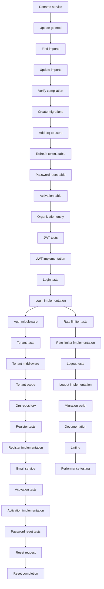

# Implementation Plan: Auth/IAM Service Migration with Multi-Tenancy

**Created**: 2025-12-09
**Spec**: [spec.md](./spec.md)

## Technical Context

### Technologies & Tools
- **Go**: 1.23.4 with Clean Architecture
- **Database**: PostgreSQL 16 with GORM ORM, pgx driver
- **Authentication**: JWT tokens (golang-jwt/jwt v5)
- **Password**: bcrypt with cost factor 12
- **Caching**: Redis for token blacklist and rate limiting
- **Email**: SMTP integration for activation and password reset
- **Rate Limiting**: Redis-based rate limiter (5 attempts per 15 minutes)
- **Shared Packages**: pkg/config, pkg/logger, pkg/database, pkg/errors, pkg/events

### Design Decisions
- **Multi-tenancy via organization_id**: Every user belongs to exactly one organization. JWT token includes organization_id in claims. All database queries automatically filtered by organization_id.
- **JWT structure**: Access token (15-min expiry) + Refresh token (7-day expiry). Access token in Authorization header, refresh token in HTTP-only cookie.
- **Token validation**: Signature verification + expiration check + blacklist check (Redis).
- **Password hashing**: bcrypt cost 12 (balance between security and performance).
- **Rate limiting**: Redis-based sliding window (5 login attempts per 15 minutes per IP).
- **Migration strategy**: Rename service directory, update imports, add organization_id to all tables, migrate existing data.
- **Clean Architecture**: Domain entities (User, Organization, Token) → Use cases (Login, Register, ValidateToken) → Repositories (GORM) → HTTP handlers (REST API).

## Project Structure

```
services/auth-service/
├── cmd/
│   └── api/
│       └── main.go                  # Entry point (UPDATE from users-service)
│
├── internal/
│   ├── core/
│   │   ├── domain/                  # Domain entities
│   │   │   ├── user.go             # User entity (ADD organization_id)
│   │   │   ├── organization.go     # Organization entity (NEW)
│   │   │   ├── refresh_token.go    # RefreshToken entity (NEW)
│   │   │   ├── password_reset.go   # PasswordResetToken entity (NEW)
│   │   │   └── activation.go       # ActivationToken entity (NEW)
│   │   │
│   │   ├── usecases/               # Business logic
│   │   │   ├── auth/
│   │   │   │   ├── login.go        # Login use case (UPDATE)
│   │   │   │   ├── register.go     # Register use case (ADD multi-tenancy)
│   │   │   │   ├── refresh.go      # Refresh token use case (NEW)
│   │   │   │   ├── logout.go       # Logout use case (NEW)
│   │   │   │   └── validate.go     # Validate token use case (UPDATE)
│   │   │   │
│   │   │   ├── user/
│   │   │   │   ├── get_user.go     # Get user details (UPDATE)
│   │   │   │   ├── update_user.go  # Update user profile (UPDATE)
│   │   │   │   └── password.go     # Change password, reset password (NEW)
│   │   │   │
│   │   │   └── organization/
│   │   │       ├── create_org.go   # Create organization (NEW)
│   │   │       └── get_org.go      # Get organization details (NEW)
│   │   │
│   │   └── providers/              # Interfaces
│   │       ├── user_repository.go  # User data access interface (UPDATE)
│   │       ├── org_repository.go   # Organization repository (NEW)
│   │       ├── token_repository.go # Token storage interface (NEW)
│   │       ├── email_service.go    # Email sending interface (NEW)
│   │       └── rate_limiter.go     # Rate limiting interface (NEW)
│   │
│   └── infrastructure/
│       ├── adapters/
│       │   ├── jwt/
│       │   │   ├── jwt_manager.go  # JWT generation and validation (UPDATE)
│       │   │   └── jwt_test.go     # (NEW)
│       │   │
│       │   ├── email/
│       │   │   ├── smtp_client.go  # SMTP email sender (NEW)
│       │   │   └── templates/      # Email templates (NEW)
│       │   │
│       │   └── rate_limiter/
│       │       ├── redis_limiter.go # Redis-based rate limiter (NEW)
│       │       └── limiter_test.go  # (NEW)
│       │
│       ├── repositories/
│       │   ├── user_repository.go   # GORM implementation (UPDATE)
│       │   ├── org_repository.go    # GORM implementation (NEW)
│       │   └── token_repository.go  # Redis implementation (NEW)
│       │
│       ├── entrypoints/
│       │   └── http/
│       │       ├── handlers/
│       │       │   ├── auth_handler.go    # Auth endpoints (UPDATE)
│       │       │   ├── user_handler.go    # User endpoints (UPDATE)
│       │       │   └── org_handler.go     # Organization endpoints (NEW)
│       │       │
│       │       ├── middleware/
│       │       │   ├── auth.go            # JWT validation middleware (UPDATE)
│       │       │   ├── tenant.go          # Tenant isolation middleware (NEW)
│       │       │   └── rate_limit.go      # Rate limiting middleware (NEW)
│       │       │
│       │       └── router.go              # HTTP router (UPDATE)
│       │
│       └── persistence/
│           └── migrations/
│               ├── 001_create_organizations.sql # (NEW)
│               ├── 002_add_org_to_users.sql     # (NEW)
│               ├── 003_create_refresh_tokens.sql # (NEW)
│               ├── 004_create_password_resets.sql # (NEW)
│               └── 005_create_activations.sql    # (NEW)
│
├── .env.example                     # Environment variables (UPDATE)
├── Dockerfile                       # Docker build (UPDATE)
├── go.mod                          # Dependencies (UPDATE imports)
└── README.md                        # Documentation (UPDATE)
```

## Phased Implementation

### Phase 1: Setup (Foundation)
**Goal**: Rename service and update imports across codebase

- **T001** [Setup]: Rename `services/users-service/` directory to `services/auth-service/`
- **T002** [Setup]: Update `go.mod` module path from `users-service` to `auth-service`
- **T003** [Setup]: Find all import statements referencing `users-service` across ALL services:
  ```bash
  grep -r "users-service" services/*/internal services/*/cmd
  ```
- **T004** [Setup]: Update all imports to use `auth-service` instead of `users-service`
- **T005** [Setup]: Update `docker-compose.yml` service name from `users-service` to `auth-service`
- **T006** [Setup]: Update `.env.example` with new multi-tenancy variables
- **T007** [Setup]: Run `go work sync` to update workspace
- **T008** [Setup]: Verify all services compile after import path changes

**Checkpoint**: Service renamed, all imports updated, codebase compiles without errors

---

### Phase 2: Foundational - Database Schema (Blocking Prerequisites)
**Goal**: Add multi-tenancy support to database schema

- **T009** [Foundational]: Create migration `001_create_organizations.sql`:
  ```sql
  CREATE TABLE organizations (
      id UUID PRIMARY KEY DEFAULT gen_random_uuid(),
      name VARCHAR(255) NOT NULL,
      slug VARCHAR(100) NOT NULL UNIQUE,
      status VARCHAR(20) NOT NULL DEFAULT 'active',
      settings JSONB DEFAULT '{}',
      created_at TIMESTAMP NOT NULL DEFAULT NOW(),
      updated_at TIMESTAMP NOT NULL DEFAULT NOW()
  );
  CREATE INDEX idx_organizations_slug ON organizations(slug);
  CREATE INDEX idx_organizations_status ON organizations(status);
  ```
- **T010** [Foundational]: Create migration `002_add_org_to_users.sql`:
  ```sql
  ALTER TABLE users ADD COLUMN organization_id UUID NOT NULL REFERENCES organizations(id);
  ALTER TABLE users ADD COLUMN status VARCHAR(20) NOT NULL DEFAULT 'active';
  ALTER TABLE users ADD COLUMN last_login_at TIMESTAMP;
  CREATE INDEX idx_users_organization_id ON users(organization_id);
  CREATE INDEX idx_users_email_org ON users(email, organization_id);
  ```
- **T011** [Foundational]: Create migration `003_create_refresh_tokens.sql`:
  ```sql
  CREATE TABLE refresh_tokens (
      id UUID PRIMARY KEY DEFAULT gen_random_uuid(),
      token_hash VARCHAR(255) NOT NULL UNIQUE,
      user_id UUID NOT NULL REFERENCES users(id) ON DELETE CASCADE,
      expires_at TIMESTAMP NOT NULL,
      revoked BOOLEAN NOT NULL DEFAULT false,
      created_at TIMESTAMP NOT NULL DEFAULT NOW()
  );
  CREATE INDEX idx_refresh_tokens_user_id ON refresh_tokens(user_id);
  CREATE INDEX idx_refresh_tokens_expires_at ON refresh_tokens(expires_at);
  ```
- **T012** [Foundational]: Create migration `004_create_password_resets.sql`:
  ```sql
  CREATE TABLE password_reset_tokens (
      id UUID PRIMARY KEY DEFAULT gen_random_uuid(),
      token_hash VARCHAR(255) NOT NULL UNIQUE,
      user_id UUID NOT NULL REFERENCES users(id) ON DELETE CASCADE,
      expires_at TIMESTAMP NOT NULL,
      used BOOLEAN NOT NULL DEFAULT false,
      created_at TIMESTAMP NOT NULL DEFAULT NOW()
  );
  CREATE INDEX idx_password_reset_tokens_user_id ON password_reset_tokens(user_id);
  ```
- **T013** [Foundational]: Create migration `005_create_activations.sql`:
  ```sql
  CREATE TABLE activation_tokens (
      id UUID PRIMARY KEY DEFAULT gen_random_uuid(),
      token_hash VARCHAR(255) NOT NULL UNIQUE,
      user_id UUID NOT NULL REFERENCES users(id) ON DELETE CASCADE,
      expires_at TIMESTAMP NOT NULL,
      used BOOLEAN NOT NULL DEFAULT false,
      created_at TIMESTAMP NOT NULL DEFAULT NOW()
  );
  ```
- **T014** [Foundational]: Create domain entity `internal/core/domain/organization.go`
- **T015** [Foundational]: Update domain entity `internal/core/domain/user.go` to include `OrganizationID` field
- **T016** [Foundational]: Create domain entities for tokens (refresh, password_reset, activation)
- **T017** [Foundational]: Run migrations on local PostgreSQL and verify schema

**Checkpoint**: Database schema supports multi-tenancy, all tables have organization_id

---

### Phase 3: User Story 1 - User Authentication (P1)
**Goal**: Implement JWT authentication with access and refresh tokens

- **T018** [P][US1]: Write test for JWT token generation with organization_id in claims
- **T019** [US1]: Implement `internal/infrastructure/adapters/jwt/jwt_manager.go`:
  - GenerateAccessToken(userID, orgID, email, roles) -> (token string, error)
  - GenerateRefreshToken(userID) -> (token string, error)
  - ValidateAccessToken(token) -> (claims, error)
  - ValidateRefreshToken(token) -> (claims, error)
- **T020** [P][US1]: Write test for login use case with valid credentials
- **T021** [US1]: Implement `internal/core/usecases/auth/login.go`:
  - Validate email format
  - Fetch user by email and organization_id
  - Verify password with bcrypt.CompareHashAndPassword()
  - Generate access + refresh tokens
  - Store refresh token hash in Redis
  - Update last_login_at timestamp
  - Return tokens + user info
- **T022** [P][US1]: Write test for login with invalid credentials (return 401)
- **T023** [US1]: Implement HTTP handler `POST /api/v1/auth/login`:
  - Validate request body
  - Call login use case
  - Return tokens in response (access token in JSON, refresh token in HTTP-only cookie)
- **T024** [P][US1]: Write test for token refresh use case
- **T025** [US1]: Implement `internal/core/usecases/auth/refresh.go`:
  - Validate refresh token
  - Check token not revoked in Redis
  - Generate new access token
  - Return new access token
- **T026** [US1]: Implement HTTP handler `POST /api/v1/auth/refresh`
- **T027** [P][US1]: Write test for token validation use case
- **T028** [US1]: Implement `internal/core/usecases/auth/validate.go`:
  - Parse JWT token
  - Verify signature and expiration
  - Check token not blacklisted in Redis
  - Return user info from claims
- **T029** [US1]: Implement authentication middleware `internal/infrastructure/entrypoints/http/middleware/auth.go`:
  - Extract token from Authorization header (Bearer {token})
  - Validate token
  - Inject user_id, organization_id into request context
  - Return 401 if invalid
- **T030** [P][US1]: Write integration test for full login flow (login → use token → refresh → use new token)

**Checkpoint**: Users can log in, receive JWT tokens, and access protected endpoints

---

### Phase 4: User Story 2 - Multi-Tenant Organization Isolation (P1)
**Goal**: Enforce organization_id filtering on all queries

- **T031** [P][US2]: Write test for tenant isolation middleware
- **T032** [US2]: Implement tenant isolation middleware `internal/infrastructure/entrypoints/http/middleware/tenant.go`:
  - Extract organization_id from JWT claims in context
  - Inject into GORM scope for automatic filtering
  - Log tenant context for debugging
- **T033** [P][US2]: Write test for GORM scope applying organization_id filter
- **T034** [US2]: Create GORM plugin `internal/infrastructure/repositories/tenant_scope.go`:
  ```go
  func TenantScope(orgID string) func(db *gorm.DB) *gorm.DB {
      return func(db *gorm.DB) *gorm.DB {
          return db.Where("organization_id = ?", orgID)
      }
  }
  ```
- **T035** [US2]: Update `internal/infrastructure/repositories/user_repository.go`:
  - Apply TenantScope to all queries
  - Ensure Create() sets organization_id from context
- **T036** [P][US2]: Write test verifying User A from Org 1 cannot access User B from Org 2
- **T037** [US2]: Implement organization repository `internal/infrastructure/repositories/org_repository.go`:
  - Create(org) - no tenant scope (system operation)
  - GetByID(id) - with tenant scope
  - GetBySlug(slug) - no tenant scope (for login)
  - Update(org) - with tenant scope
- **T038** [P][US2]: Write test for JWT claims including organization_id
- **T039** [US2]: Update JWT token generation to include `organization_id` in claims
- **T040** [P][US2]: Write integration test: create 2 orgs, 2 users, verify isolation via API calls
- **T041** [US2]: Add audit logging for cross-tenant access attempts

**Checkpoint**: Multi-tenant isolation enforced, queries automatically filtered by organization_id

---

### Phase 5: User Story 3 - User Registration and Activation (P2)
**Goal**: Implement self-service registration with email activation

- **T042** [P][US3]: Write test for user registration use case
- **T043** [US3]: Implement `internal/core/usecases/auth/register.go`:
  - Validate email format and password complexity
  - Check email uniqueness across ALL organizations
  - Hash password with bcrypt cost 12
  - Create user with status='inactive'
  - Generate activation token (UUID)
  - Store activation token hash in database
  - Publish "user.registered" event to NATS
  - Return success message
- **T044** [US3]: Implement password validation helper:
  - Min 8 characters
  - At least 1 uppercase, 1 lowercase, 1 number, 1 special char
- **T045** [P][US3]: Write test for duplicate email prevention
- **T046** [US3]: Implement HTTP handler `POST /api/v1/auth/register`
- **T047** [P][US3]: Write test for email service (mock SMTP)
- **T048** [US3]: Implement email service interface `internal/core/providers/email_service.go`
- **T049** [US3]: Implement SMTP adapter `internal/infrastructure/adapters/email/smtp_client.go`:
  - Connect to SMTP server (configurable host, port, credentials)
  - SendActivationEmail(to, token)
  - SendPasswordResetEmail(to, token)
  - Use HTML templates from `templates/` directory
- **T050** [US3]: Create email template `internal/infrastructure/adapters/email/templates/activation.html`
- **T051** [P][US3]: Write test for account activation use case
- **T052** [US3]: Implement `internal/core/usecases/auth/activate.go`:
  - Validate activation token
  - Check token not expired (24 hours)
  - Check token not used
  - Update user status to 'active'
  - Mark token as used
  - Return success
- **T053** [US3]: Implement HTTP handler `POST /api/v1/auth/activate` (token in query param or body)
- **T054** [P][US3]: Write integration test for full registration flow (register → receive email → activate → login)

**Checkpoint**: Users can self-register, receive activation email, and activate accounts

---

### Phase 6: User Story 4 - Password Reset (P3)
**Goal**: Implement password reset flow with email tokens

- **T055** [P][US4]: Write test for password reset request use case
- **T056** [US4]: Implement `internal/core/usecases/user/request_password_reset.go`:
  - Validate email exists
  - Generate password reset token (UUID)
  - Store token hash in database with 1-hour expiration
  - Send password reset email
  - Return success (even if email not found - prevent enumeration)
- **T057** [US4]: Implement HTTP handler `POST /api/v1/auth/password-reset/request`
- **T058** [US4]: Create email template `internal/infrastructure/adapters/email/templates/password_reset.html`
- **T059** [P][US4]: Write test for password reset completion use case
- **T060** [US4]: Implement `internal/core/usecases/user/complete_password_reset.go`:
  - Validate reset token
  - Check token not expired (1 hour)
  - Check token not used
  - Validate new password complexity
  - Hash new password with bcrypt
  - Update user password
  - Mark token as used
  - Invalidate all user's refresh tokens (force re-login)
- **T061** [US4]: Implement HTTP handler `POST /api/v1/auth/password-reset/complete`
- **T062** [P][US4]: Write test for expired token rejection
- **T063** [US4]: Add token cleanup job to delete expired tokens (optional: cron job or manual)
- **T064** [P][US4]: Write integration test for full password reset flow

**Checkpoint**: Users can reset forgotten passwords via email

---

### Phase 7: Rate Limiting and Security (Cross-Cutting)
**Goal**: Implement rate limiting and security hardening

- **T065** [P]: Write test for Redis-based rate limiter
- **T066**: Implement `internal/infrastructure/adapters/rate_limiter/redis_limiter.go`:
  - CheckRateLimit(key, limit, window) -> (allowed bool, retryAfter time.Duration)
  - Use Redis INCR with EXPIRE for sliding window
  - Return remaining attempts and reset time
- **T067**: Implement rate limiting middleware `internal/infrastructure/entrypoints/http/middleware/rate_limit.go`:
  - Extract IP address from request
  - Check rate limit (5 attempts per 15 minutes for /auth/login)
  - Return 429 Too Many Requests if exceeded
  - Include Retry-After header
- **T068**: Apply rate limiting to login endpoint
- **T069** [P]: Write test for token blacklist (logout functionality)
- **T070**: Implement logout use case `internal/core/usecases/auth/logout.go`:
  - Add access token to Redis blacklist (TTL = token expiration)
  - Revoke refresh token in database
  - Return success
- **T071**: Implement HTTP handler `POST /api/v1/auth/logout`
- **T072**: Update token validation to check blacklist
- **T073**: Implement token repository `internal/infrastructure/repositories/token_repository.go` (Redis):
  - BlacklistToken(token, ttl)
  - IsTokenBlacklisted(token)
  - StoreRefreshToken(tokenHash, userID, expiresAt)
  - GetRefreshToken(tokenHash)
  - RevokeRefreshToken(tokenHash)
  - RevokeAllUserTokens(userID)

**Checkpoint**: Rate limiting and logout functionality implemented

---

### Phase 8: Data Migration (Legacy Users Service)
**Goal**: Migrate existing users from legacy users-service database

- **T074**: Create migration script `scripts/migrate_users.go`:
  - Connect to legacy database
  - Create default organization for existing users (or map to organizations)
  - Copy users table to new schema with organization_id
  - Hash passwords if not already hashed (verify bcrypt)
  - Set default status='active'
  - Verify data integrity
- **T075**: Test migration script on staging database
- **T076**: Document migration procedure in README
- **T077**: Create rollback plan (backup database before migration)
- **T078**: Execute migration on production (after approval)

**Checkpoint**: Legacy users migrated to new multi-tenant schema

---

### Phase 9: Polish (Documentation and Edge Cases)
**Goal**: Complete documentation, handle edge cases, optimize performance

- **T079** [Polish]: Update service README.md with:
  - Architecture overview
  - API endpoints documentation
  - Multi-tenancy explanation
  - JWT token structure
  - Environment variables
  - Local development guide
- **T080** [Polish]: Generate OpenAPI/Swagger documentation from code
- **T081** [Polish]: Add Postman collection for API testing
- **T082** [Polish]: Implement concurrent login attempt handling (lock user account after N failed attempts)
- **T083** [Polish]: Add metrics for authentication operations (Prometheus):
  - Login attempts counter (success/failure)
  - Token validation latency histogram
  - Active users gauge
  - Registration counter
- **T084** [Polish]: Implement graceful shutdown (wait for in-flight requests)
- **T085** [Polish]: Add health check endpoint `/health`:
  - Database connection check
  - Redis connection check
  - Return 200 OK or 503 Service Unavailable
- **T086** [Polish]: Optimize JWT validation with caching (Redis):
  - Cache valid tokens for 1 minute
  - Invalidate cache on logout
  - Reduce database queries
- **T087** [Polish]: Handle edge case: User deactivation while token is valid
  - Add user status check in token validation
  - Return 401 if user inactive or deleted
- **T088** [Polish]: Handle edge case: Organization suspension
  - Add organization status check in middleware
  - Return 403 if organization suspended
- **T089** [Polish]: Add comprehensive logging for security events:
  - Failed login attempts
  - Successful logins
  - Password resets
  - Account activations
  - Token validations (errors only)
- **T090** [Polish]: Run golangci-lint and fix issues
- **T091** [Polish]: Run security audit with gosec
- **T092** [Polish]: Generate test coverage report, ensure >80%
- **T093** [Polish]: Performance testing: 1000 concurrent login requests
- **T094** [Polish]: Load testing: 10,000 token validations per second

**Checkpoint**: Service production-ready with documentation, monitoring, and performance validation

---

## Task Dependencies



**Critical Path**: T001 → T008 → T014 → T021 → T032 → T043 → T079

## Execution Strategy

### Recommended Order (Single Developer)
**Week 1: Foundation**
- Day 1: Phase 1 (Setup - rename and imports)
- Day 2: Phase 2 (Database schema and migrations)
- Day 3-4: Phase 3 (User authentication with JWT)
- Day 5: Phase 4 (Multi-tenant isolation)

**Week 2: Features**
- Day 1-2: Phase 5 (User registration and activation)
- Day 3: Phase 6 (Password reset)
- Day 4: Phase 7 (Rate limiting and security)
- Day 5: Phase 8 (Data migration)

**Week 3: Polish**
- Day 1-2: Phase 9 (Documentation, optimization, testing)
- Day 3: Final integration testing and bug fixes

### Team of 2 Developers
**Week 1**
- Dev A: Phase 1-2 (Setup + Database) + Phase 3 (Authentication)
- Dev B: Phase 4 (Multi-tenancy) + Phase 5 (Registration)

**Week 2**
- Dev A: Phase 6 (Password reset) + Phase 7 (Rate limiting)
- Dev B: Phase 8 (Migration) + Phase 9 (Polish)

**Total: 12-15 days single developer, 8-10 days with 2 developers**

## Testing Strategy

### Unit Testing (Test-First Approach)
- Write test BEFORE implementation for all use cases
- Mock external dependencies (database, email, Redis)
- Target: >80% coverage per package
- Use testify/mock for repository mocks

### Integration Testing
- Test full authentication flow with real PostgreSQL and Redis (docker-compose)
- Test multi-tenant isolation with 2 organizations
- Test email flow with mock SMTP server
- Test rate limiting with concurrent requests

### Security Testing
- Test SQL injection prevention (parameterized queries)
- Test JWT signature verification
- Test token expiration enforcement
- Test password complexity validation
- Test cross-tenant access attempts (should fail)
- Test rate limiting bypass attempts

### Performance Testing
- Load test: 1000 concurrent login requests
- Benchmark: 10,000 token validations per second
- Measure: Login latency <500ms (p95)
- Measure: Token validation latency <50ms (p95)

### Manual Testing Checklist
- [ ] User can register, receive email, activate account
- [ ] User can log in with valid credentials
- [ ] User cannot log in with invalid credentials
- [ ] User receives access token and refresh token
- [ ] User can access protected endpoint with access token
- [ ] User can refresh access token with refresh token
- [ ] User can log out (token blacklisted)
- [ ] User cannot use token after logout
- [ ] User from Org A cannot access data from Org B
- [ ] Rate limiting blocks after 5 failed login attempts
- [ ] User can request password reset and receive email
- [ ] User can reset password with valid token
- [ ] Expired tokens are rejected

## Risks & Mitigations

| Risk | Impact | Mitigation |
|------|--------|------------|
| Import path changes break other services | High | Search all services for imports, update systematically, verify compilation |
| Data loss during migration | Critical | Backup database before migration, test on staging first, have rollback plan |
| Performance degradation from tenant filtering | Medium | Index organization_id columns, cache user permissions, benchmark queries |
| Email service unavailable during registration | Medium | Queue email sending, retry with exponential backoff, log failures |
| JWT secret compromise | Critical | Use strong random secret, rotate periodically, store in secrets manager |
| Rate limiting bypass via multiple IPs | Medium | Track rate limits by user_id in addition to IP, implement CAPTCHA for high failure rates |
| Token blacklist memory growth | Low | Set TTL on blacklisted tokens (expire with token expiration), monitor Redis memory |
| Concurrent login attempts (race conditions) | Low | Use Redis locks for critical sections, database transactions for token creation |

## Rollout Plan

1. **PR 1**: Foundation (Phase 1 + Phase 2) - Rename service, update imports, database migrations
2. **PR 2**: Authentication Core (Phase 3) - JWT implementation, login, token validation
3. **PR 3**: Multi-Tenancy (Phase 4) - Organization isolation, tenant middleware, scoped queries
4. **PR 4**: Registration Flow (Phase 5) - User registration, email activation, SMTP integration
5. **PR 5**: Password Management (Phase 6) - Password reset flow, email templates
6. **PR 6**: Security (Phase 7) - Rate limiting, logout, token blacklist
7. **PR 7**: Migration (Phase 8) - Data migration script, legacy user import
8. **PR 8**: Polish (Phase 9) - Documentation, optimization, performance testing

Each PR should be independently reviewable and deployable to staging.

---

**Estimated Effort**: 12-15 days (single developer), 8-10 days (team of 2)
**Complexity**: High (architecture migration + multi-tenancy + security)
**Blockers**: Task 3 (local infrastructure), Task 4 (shared packages)
**Enables**: Task 6 (RBAC requires Auth), Task 7 (gRPC server), Task 9 (Catalog service needs auth)
