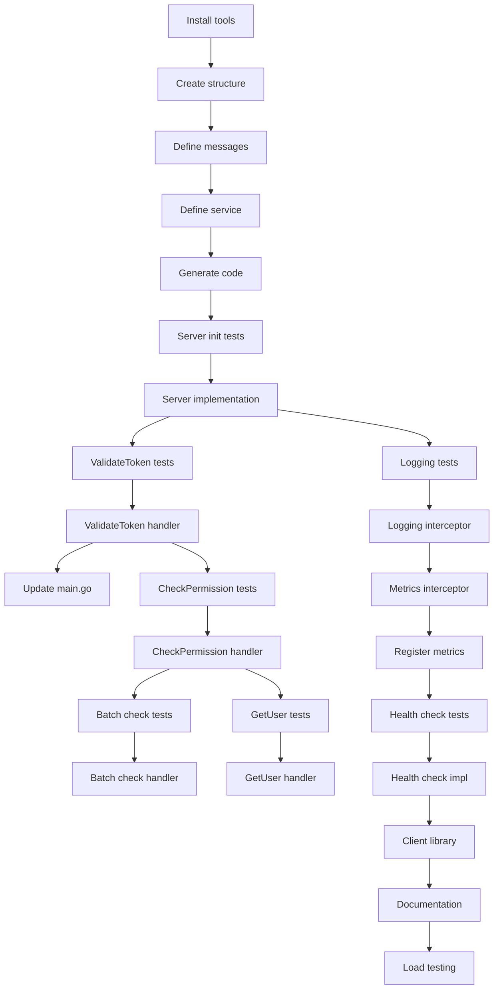

# Implementation Plan: gRPC Server for Auth Service

**Created**: 2025-12-09
**Spec**: [spec.md](./spec.md)

## Technical Context

### Technologies & Tools
- **gRPC**: google.golang.org/grpc v1.60+
- **Protocol Buffers**: proto3 syntax, protoc compiler
- **Code Generation**: protoc-gen-go, protoc-gen-go-grpc
- **Reflection**: grpc-reflection for debugging with grpcurl
- **Health Check**: grpc-health-v1 standard health checking protocol
- **Interceptors**: For logging, metrics, tracing, error handling
- **Gateway**: grpc-gateway (optional) for REST-to-gRPC translation
- **Testing**: testify/mock, grpc testing package

### Design Decisions
- **Port separation**: gRPC on :9091, HTTP on :8081 (separate servers)
- **Synchronous RPC**: ValidateToken and CheckPermission are blocking calls (<10ms target)
- **Caching**: Leverage existing Redis cache from Task 5 and Task 6
- **Error codes**: Use standard gRPC status codes (UNAUTHENTICATED, PERMISSION_DENIED, NOT_FOUND, INTERNAL)
- **Interceptor chain**: Request ID → Logging → Metrics → Error handling → Business logic
- **Health checks**: Implement both serving status and dependency checks (database, Redis)
- **Service definition**: Single .proto file for auth service, separate files for common types
- **Metadata propagation**: Extract request_id, organization_id from metadata for tracing

## Project Structure

```
services/auth-service/
├── api/
│   └── proto/
│       ├── auth/
│       │   └── v1/
│       │       ├── auth.proto           # Main service definition (NEW)
│       │       ├── messages.proto       # Common message types (NEW)
│       │       └── errors.proto         # Error definitions (NEW)
│       │
│       └── gen/                         # Generated code (gitignored)
│           └── go/
│               └── auth/
│                   └── v1/
│                       ├── auth.pb.go
│                       └── auth_grpc.pb.go
│
├── internal/
│   ├── infrastructure/
│   │   ├── grpc/
│   │   │   ├── server/
│   │   │   │   ├── server.go           # gRPC server setup (NEW)
│   │   │   │   ├── auth_service.go     # AuthService implementation (NEW)
│   │   │   │   └── health_service.go   # Health check implementation (NEW)
│   │   │   │
│   │   │   ├── interceptors/
│   │   │   │   ├── logging.go          # Request/response logging (NEW)
│   │   │   │   ├── metrics.go          # Prometheus metrics (NEW)
│   │   │   │   ├── tracing.go          # Distributed tracing (NEW)
│   │   │   │   ├── error_handler.go    # Error translation (NEW)
│   │   │   │   └── recovery.go         # Panic recovery (NEW)
│   │   │   │
│   │   │   └── client/
│   │   │       └── auth_client.go      # Client for testing (NEW)
│   │   │
│   │   └── entrypoints/
│   │       └── grpc/
│   │           └── handlers/
│   │               ├── validate_token.go    # ValidateToken RPC handler (NEW)
│   │               ├── check_permission.go  # CheckPermission RPC handler (NEW)
│   │               ├── batch_check.go       # BatchCheckPermissions RPC (NEW)
│   │               └── get_user.go          # GetUser RPC handler (NEW)
│   │
│   └── core/
│       └── usecases/
│           └── grpc/
│               ├── validate_token.go    # Use case for gRPC (reuse from Task 5)
│               └── check_permission.go  # Use case for gRPC (reuse from Task 6)
│
├── cmd/
│   └── api/
│       └── main.go                      # Updated to start both HTTP and gRPC servers
│
├── scripts/
│   ├── generate-proto.sh                # Script to generate Go code from proto
│   └── test-grpc.sh                     # Script to test with grpcurl
│
├── buf.yaml                             # Buf configuration (proto linting)
├── buf.gen.yaml                         # Buf code generation config
└── README_GRPC.md                       # gRPC documentation (NEW)
```

## Phased Implementation

### Phase 1: Setup (Foundation)
**Goal**: Install tools and create proto definitions

- **T001** [Setup]: Install protoc compiler and plugins:
  ```bash
  go install google.golang.org/protobuf/cmd/protoc-gen-go@latest
  go install google.golang.org/grpc/cmd/protoc-gen-go-grpc@latest
  go install github.com/bufbuild/buf/cmd/buf@latest
  ```
- **T002** [Setup]: Add gRPC dependencies to `go.mod`:
  ```
  google.golang.org/grpc v1.60.1
  google.golang.org/protobuf v1.32.0
  google.golang.org/genproto/googleapis/api v0.0.0-20240102182953-50ed04b92917
  ```
- **T003** [Setup]: Create directory structure `api/proto/auth/v1/`
- **T004** [Setup]: Create `buf.yaml` for proto linting:
  ```yaml
  version: v1
  breaking:
    use:
      - FILE
  lint:
    use:
      - DEFAULT
  ```
- **T005** [Setup]: Create `buf.gen.yaml` for code generation:
  ```yaml
  version: v1
  plugins:
    - plugin: buf.build/protocolbuffers/go
      out: api/proto/gen/go
      opt: paths=source_relative
    - plugin: buf.build/grpc/go
      out: api/proto/gen/go
      opt: paths=source_relative
  ```
- **T006** [Setup]: Create `scripts/generate-proto.sh`:
  ```bash
  #!/bin/bash
  buf generate api/proto
  ```
- **T007** [Setup]: Add `api/proto/gen/` to `.gitignore`

**Checkpoint**: Tools installed, proto structure created

---

### Phase 2: Foundational - Proto Definitions (Blocking Prerequisites)
**Goal**: Define gRPC service contracts

- **T008** [Foundational]: Create `api/proto/auth/v1/messages.proto`:
  ```protobuf
  syntax = "proto3";
  package auth.v1;
  option go_package = "github.com/giia/auth-service/api/proto/gen/go/auth/v1";

  message UserInfo {
      string user_id = 1;
      string organization_id = 2;
      string email = 3;
      repeated string roles = 4;
      string name = 5;
      string status = 6;
  }

  message Permission {
      string code = 1;
      string description = 2;
  }
  ```
- **T009** [Foundational]: Create `api/proto/auth/v1/auth.proto`:
  ```protobuf
  syntax = "proto3";
  package auth.v1;
  import "auth/v1/messages.proto";
  option go_package = "github.com/giia/auth-service/api/proto/gen/go/auth/v1";

  service AuthService {
      rpc ValidateToken(ValidateTokenRequest) returns (ValidateTokenResponse);
      rpc CheckPermission(CheckPermissionRequest) returns (CheckPermissionResponse);
      rpc BatchCheckPermissions(BatchCheckPermissionsRequest) returns (BatchCheckPermissionsResponse);
      rpc GetUser(GetUserRequest) returns (GetUserResponse);
  }

  message ValidateTokenRequest {
      string token = 1;
  }

  message ValidateTokenResponse {
      UserInfo user = 1;
      repeated string permissions = 2;
  }

  message CheckPermissionRequest {
      string user_id = 1;
      string organization_id = 2;
      string permission = 3;
  }

  message CheckPermissionResponse {
      bool allowed = 1;
      string reason = 2;
  }

  message BatchCheckPermissionsRequest {
      string user_id = 1;
      string organization_id = 2;
      repeated string permissions = 3;
  }

  message BatchCheckPermissionsResponse {
      repeated bool results = 1;
  }

  message GetUserRequest {
      string user_id = 1;
      string organization_id = 2;
  }

  message GetUserResponse {
      UserInfo user = 1;
  }
  ```
- **T010** [Foundational]: Run `buf lint` to validate proto files
- **T011** [Foundational]: Run `buf generate` to generate Go code
- **T012** [Foundational]: Verify generated code compiles without errors

**Checkpoint**: Proto files defined and code generated

---

### Phase 3: User Story 1 - Token Validation RPC (P1)
**Goal**: Implement ValidateToken gRPC method

- **T013** [P][US1]: Write test for gRPC server initialization
- **T014** [US1]: Implement `internal/infrastructure/grpc/server/server.go`:
  ```go
  func NewGRPCServer(
      validateTokenUC usecases.ValidateTokenUseCase,
      checkPermissionUC usecases.CheckPermissionUseCase,
      getUserUC usecases.GetUserUseCase,
      logger logger.Logger,
  ) (*grpc.Server, error) {
      // Create gRPC server with interceptors
      server := grpc.NewServer(
          grpc.ChainUnaryInterceptor(
              interceptors.LoggingInterceptor(logger),
              interceptors.MetricsInterceptor(),
              interceptors.RecoveryInterceptor(),
              interceptors.ErrorHandlerInterceptor(),
          ),
      )

      // Register services
      authpb.RegisterAuthServiceServer(server, &authService{...})
      grpc_health_v1.RegisterHealthServer(server, &healthService{...})

      // Register reflection service
      reflection.Register(server)

      return server, nil
  }
  ```
- **T015** [P][US1]: Write test for ValidateToken handler (mock use case)
- **T016** [US1]: Implement `internal/infrastructure/entrypoints/grpc/handlers/validate_token.go`:
  ```go
  func (h *ValidateTokenHandler) ValidateToken(ctx context.Context, req *authpb.ValidateTokenRequest) (*authpb.ValidateTokenResponse, error) {
      // Validate request
      if req.Token == "" {
          return nil, status.Error(codes.InvalidArgument, "token is required")
      }

      // Call use case
      userInfo, err := h.validateTokenUseCase.Execute(ctx, req.Token)
      if err != nil {
          // Translate to gRPC error
          return nil, translateError(err)
      }

      // Get user permissions
      permissions, err := h.getPermissionsUseCase.Execute(ctx, userInfo.UserID)
      if err != nil {
          logger.Warn(ctx, "Failed to get permissions", logs.Tags{"user_id": userInfo.UserID})
          permissions = []string{}
      }

      // Build response
      return &authpb.ValidateTokenResponse{
          User: &authpb.UserInfo{
              UserId:         userInfo.UserID,
              OrganizationId: userInfo.OrganizationID,
              Email:          userInfo.Email,
              Roles:          userInfo.Roles,
              Name:           userInfo.Name,
              Status:         userInfo.Status,
          },
          Permissions: permissions,
      }, nil
  }
  ```
- **T017** [US1]: Implement error translation helper `translateError()`:
  - pkg/errors.BadRequest → codes.InvalidArgument
  - pkg/errors.Unauthorized → codes.Unauthenticated
  - pkg/errors.NotFound → codes.NotFound
  - pkg/errors.InternalServerError → codes.Internal
- **T018** [P][US1]: Write integration test for ValidateToken (real gRPC call)
- **T019** [US1]: Update `cmd/api/main.go` to start gRPC server on :9091:
  ```go
  // Start gRPC server in goroutine
  grpcServer := grpc.NewGRPCServer(...)
  listener, _ := net.Listen("tcp", ":9091")
  go func() {
      if err := grpcServer.Serve(listener); err != nil {
          logger.Fatal(ctx, err, "gRPC server failed")
      }
  }()

  // Start HTTP server on :8081 (existing)
  httpServer := http.NewHTTPServer(...)
  httpServer.ListenAndServe(":8081")
  ```
- **T020** [P][US1]: Test with grpcurl:
  ```bash
  grpcurl -plaintext -d '{"token": "eyJ..."}' localhost:9091 auth.v1.AuthService/ValidateToken
  ```
- **T021** [US1]: Implement caching for ValidateToken (reuse Redis cache from Task 5)

**Checkpoint**: ValidateToken RPC works and returns user info

---

### Phase 4: User Story 2 - Permission Checking RPC (P1)
**Goal**: Implement CheckPermission and BatchCheckPermissions

- **T022** [P][US2]: Write test for CheckPermission handler
- **T023** [US2]: Implement `internal/infrastructure/entrypoints/grpc/handlers/check_permission.go`:
  ```go
  func (h *CheckPermissionHandler) CheckPermission(ctx context.Context, req *authpb.CheckPermissionRequest) (*authpb.CheckPermissionResponse, error) {
      // Validate request
      if req.UserId == "" || req.Permission == "" {
          return nil, status.Error(codes.InvalidArgument, "user_id and permission are required")
      }

      // Call use case (from Task 6)
      allowed, err := h.checkPermissionUseCase.Execute(ctx, req.UserId, req.Permission)
      if err != nil {
          return nil, status.Error(codes.Internal, "permission check failed")
      }

      reason := "allowed"
      if !allowed {
          reason = "permission denied"
      }

      return &authpb.CheckPermissionResponse{
          Allowed: allowed,
          Reason:  reason,
      }, nil
  }
  ```
- **T024** [P][US2]: Write test for BatchCheckPermissions
- **T025** [US2]: Implement `internal/infrastructure/entrypoints/grpc/handlers/batch_check.go`:
  ```go
  func (h *Handler) BatchCheckPermissions(ctx context.Context, req *authpb.BatchCheckPermissionsRequest) (*authpb.BatchCheckPermissionsResponse, error) {
      if req.UserId == "" || len(req.Permissions) == 0 {
          return nil, status.Error(codes.InvalidArgument, "user_id and permissions are required")
      }

      // Call batch use case (from Task 6)
      results, err := h.batchCheckUseCase.Execute(ctx, req.UserId, req.Permissions)
      if err != nil {
          return nil, status.Error(codes.Internal, "batch check failed")
      }

      return &authpb.BatchCheckPermissionsResponse{
          Results: results,
      }, nil
  }
  ```
- **T026** [P][US2]: Write performance test: 100 concurrent CheckPermission calls
- **T027** [US2]: Benchmark CheckPermission latency:
  - Cache hit: <10ms (p95)
  - Cache miss: <50ms (p95)
- **T028** [P][US2]: Test with grpcurl:
  ```bash
  grpcurl -plaintext -d '{"user_id": "123", "permission": "catalog:products:read"}' localhost:9091 auth.v1.AuthService/CheckPermission
  ```

**Checkpoint**: Permission checking via gRPC works with <10ms latency

---

### Phase 5: User Story 3 - User Info Retrieval (P2)
**Goal**: Implement GetUser RPC

- **T029** [P][US3]: Write test for GetUser handler
- **T030** [US3]: Implement `internal/infrastructure/entrypoints/grpc/handlers/get_user.go`:
  ```go
  func (h *GetUserHandler) GetUser(ctx context.Context, req *authpb.GetUserRequest) (*authpb.GetUserResponse, error) {
      if req.UserId == "" {
          return nil, status.Error(codes.InvalidArgument, "user_id is required")
      }

      // Call use case
      user, err := h.getUserUseCase.Execute(ctx, req.UserId, req.OrganizationId)
      if err != nil {
          if errors.IsNotFound(err) {
              return nil, status.Error(codes.NotFound, "user not found")
          }
          return nil, status.Error(codes.Internal, "failed to get user")
      }

      // Enforce tenant isolation
      if req.OrganizationId != "" && user.OrganizationID != req.OrganizationId {
          return nil, status.Error(codes.PermissionDenied, "user belongs to different organization")
      }

      return &authpb.GetUserResponse{
          User: &authpb.UserInfo{
              UserId:         user.ID,
              OrganizationId: user.OrganizationID,
              Email:          user.Email,
              Name:           user.Name,
              Status:         user.Status,
              Roles:          user.Roles,
          },
      }, nil
  }
  ```
- **T031** [P][US3]: Write test for tenant isolation (User A cannot get User B from different org)
- **T032** [US3]: Test with grpcurl:
  ```bash
  grpcurl -plaintext -d '{"user_id": "123", "organization_id": "org-1"}' localhost:9091 auth.v1.AuthService/GetUser
  ```

**Checkpoint**: GetUser RPC works with tenant isolation

---

### Phase 6: gRPC Interceptors (Cross-Cutting)
**Goal**: Implement logging, metrics, and error handling

- **T033** [P]: Write test for logging interceptor
- **T034**: Implement `internal/infrastructure/grpc/interceptors/logging.go`:
  ```go
  func LoggingInterceptor(logger logger.Logger) grpc.UnaryServerInterceptor {
      return func(ctx context.Context, req interface{}, info *grpc.UnaryServerInfo, handler grpc.UnaryHandler) (interface{}, error) {
          start := time.Now()

          // Extract metadata
          md, _ := metadata.FromIncomingContext(ctx)
          requestID := extractRequestID(md)

          // Inject request_id into context
          ctx = context.WithValue(ctx, "request_id", requestID)

          // Log request
          logger.Info(ctx, "gRPC request started", logs.Tags{
              "method": info.FullMethod,
              "request_id": requestID,
          })

          // Call handler
          resp, err := handler(ctx, req)

          // Log response
          duration := time.Since(start)
          if err != nil {
              logger.Error(ctx, err, "gRPC request failed", logs.Tags{
                  "method": info.FullMethod,
                  "duration_ms": duration.Milliseconds(),
              })
          } else {
              logger.Info(ctx, "gRPC request completed", logs.Tags{
                  "method": info.FullMethod,
                  "duration_ms": duration.Milliseconds(),
              })
          }

          return resp, err
      }
  }
  ```
- **T035** [P]: Write test for metrics interceptor
- **T036**: Implement `internal/infrastructure/grpc/interceptors/metrics.go`:
  ```go
  var (
      grpcRequestsTotal = prometheus.NewCounterVec(
          prometheus.CounterOpts{
              Name: "grpc_requests_total",
              Help: "Total number of gRPC requests",
          },
          []string{"method", "status"},
      )

      grpcRequestDuration = prometheus.NewHistogramVec(
          prometheus.HistogramOpts{
              Name: "grpc_request_duration_seconds",
              Help: "gRPC request duration",
              Buckets: []float64{.001, .005, .01, .025, .05, .1, .25, .5, 1},
          },
          []string{"method"},
      )
  )

  func MetricsInterceptor() grpc.UnaryServerInterceptor {
      return func(ctx context.Context, req interface{}, info *grpc.UnaryServerInfo, handler grpc.UnaryHandler) (interface{}, error) {
          start := time.Now()

          resp, err := handler(ctx, req)

          duration := time.Since(start)
          status := "success"
          if err != nil {
              status = "error"
          }

          grpcRequestsTotal.WithLabelValues(info.FullMethod, status).Inc()
          grpcRequestDuration.WithLabelValues(info.FullMethod).Observe(duration.Seconds())

          return resp, err
      }
  }
  ```
- **T037**: Implement `internal/infrastructure/grpc/interceptors/recovery.go` (panic recovery)
- **T038**: Implement `internal/infrastructure/grpc/interceptors/error_handler.go` (consistent error responses)
- **T039**: Register Prometheus metrics with HTTP server `/metrics` endpoint
- **T040**: Test interceptor chain with failing request (verify all interceptors called)

**Checkpoint**: Interceptors work for logging, metrics, and error handling

---

### Phase 7: User Story 4 - Health Checks (P3)
**Goal**: Implement gRPC health check service

- **T041** [P][US4]: Write test for health check service
- **T042** [US4]: Implement `internal/infrastructure/grpc/server/health_service.go`:
  ```go
  import "google.golang.org/grpc/health/grpc_health_v1"

  type HealthService struct {
      grpc_health_v1.UnimplementedHealthServer
      db    *gorm.DB
      redis *redis.Client
  }

  func (s *HealthService) Check(ctx context.Context, req *grpc_health_v1.HealthCheckRequest) (*grpc_health_v1.HealthCheckResponse, error) {
      // Check database
      if err := s.db.Raw("SELECT 1").Error; err != nil {
          return &grpc_health_v1.HealthCheckResponse{
              Status: grpc_health_v1.HealthCheckResponse_NOT_SERVING,
          }, nil
      }

      // Check Redis
      if err := s.redis.Ping(ctx).Err(); err != nil {
          return &grpc_health_v1.HealthCheckResponse{
              Status: grpc_health_v1.HealthCheckResponse_NOT_SERVING,
          }, nil
      }

      return &grpc_health_v1.HealthCheckResponse{
          Status: grpc_health_v1.HealthCheckResponse_SERVING,
      }, nil
  }

  func (s *HealthService) Watch(req *grpc_health_v1.HealthCheckRequest, stream grpc_health_v1.Health_WatchServer) error {
      // Not implemented for now
      return status.Error(codes.Unimplemented, "watch not implemented")
  }
  ```
- **T043** [US4]: Test health check with grpcurl:
  ```bash
  grpcurl -plaintext localhost:9091 grpc.health.v1.Health/Check
  ```
- **T044** [US4]: Configure Kubernetes to use gRPC health check in deployment manifest

**Checkpoint**: gRPC health check works and Kubernetes can monitor it

---

### Phase 8: Client Library (Supporting Other Services)
**Goal**: Create reusable gRPC client for other services

- **T045**: Create `internal/infrastructure/grpc/client/auth_client.go`:
  ```go
  type AuthClient struct {
      conn   *grpc.ClientConn
      client authpb.AuthServiceClient
  }

  func NewAuthClient(addr string) (*AuthClient, error) {
      conn, err := grpc.Dial(addr, grpc.WithInsecure())
      if err != nil {
          return nil, err
      }

      return &AuthClient{
          conn:   conn,
          client: authpb.NewAuthServiceClient(conn),
      }, nil
  }

  func (c *AuthClient) ValidateToken(ctx context.Context, token string) (*authpb.UserInfo, error) {
      resp, err := c.client.ValidateToken(ctx, &authpb.ValidateTokenRequest{
          Token: token,
      })
      if err != nil {
          return nil, err
      }
      return resp.User, nil
  }

  func (c *AuthClient) CheckPermission(ctx context.Context, userID, permission string) (bool, error) {
      resp, err := c.client.CheckPermission(ctx, &authpb.CheckPermissionRequest{
          UserId:     userID,
          Permission: permission,
      })
      if err != nil {
          return false, err
      }
      return resp.Allowed, nil
  }

  func (c *AuthClient) Close() error {
      return c.conn.Close()
  }
  ```
- **T046**: Create example usage in `examples/grpc_client_example.go`
- **T047**: Document client usage in README_GRPC.md
- **T048**: Create shared proto package for other services to import:
  - Move generated proto code to `pkg/authproto/`
  - Publish as importable Go module
  - Document import path

**Checkpoint**: Other services can easily call Auth gRPC APIs

---

### Phase 9: Polish (Testing, Documentation, Optimization)
**Goal**: Production-ready gRPC server

- **T049** [Polish]: Create `README_GRPC.md` documentation:
  - Service overview
  - RPC method descriptions
  - Request/response examples
  - Error codes reference
  - Client library usage
  - Performance benchmarks
  - Troubleshooting guide
- **T050** [Polish]: Create `scripts/test-grpc.sh` for manual testing:
  ```bash
  #!/bin/bash
  # Test ValidateToken
  grpcurl -plaintext -d '{"token": "$TOKEN"}' localhost:9091 auth.v1.AuthService/ValidateToken

  # Test CheckPermission
  grpcurl -plaintext -d '{"user_id": "123", "permission": "catalog:products:read"}' localhost:9091 auth.v1.AuthService/CheckPermission

  # Health check
  grpcurl -plaintext localhost:9091 grpc.health.v1.Health/Check
  ```
- **T051** [Polish]: Generate gRPC API documentation from proto files (use protoc-gen-doc)
- **T052** [Polish]: Add Postman collection for gRPC testing (requires Postman 10+)
- **T053** [Polish]: Implement graceful shutdown for gRPC server:
  ```go
  func GracefulShutdown(grpcServer *grpc.Server) {
      sigChan := make(chan os.Signal, 1)
      signal.Notify(sigChan, os.Interrupt, syscall.SIGTERM)
      <-sigChan

      logger.Info(ctx, "Shutting down gRPC server...")
      grpcServer.GracefulStop()
  }
  ```
- **T054** [Polish]: Implement connection pooling in client library
- **T055** [Polish]: Add request timeout configuration (default 30 seconds)
- **T056** [Polish]: Load test: 10,000 concurrent gRPC requests
- **T057** [Polish]: Benchmark latency for each RPC method:
  - ValidateToken: <10ms (p95)
  - CheckPermission: <10ms (p95)
  - GetUser: <20ms (p95)
- **T058** [Polish]: Optimize ValidateToken with response caching (1 minute TTL)
- **T059** [Polish]: Handle edge case: Token expired during request processing
- **T060** [Polish]: Handle edge case: Database connection lost during RPC
- **T061** [Polish]: Implement retry logic in client library (exponential backoff, max 3 retries)
- **T062** [Polish]: Add distributed tracing with OpenTelemetry (optional):
  - Instrument interceptors
  - Propagate trace context
  - Export to Jaeger/Zipkin
- **T063** [Polish]: Run golangci-lint on gRPC code
- **T064** [Polish]: Generate test coverage report for gRPC handlers (>80%)
- **T065** [Polish]: Document deployment configuration (ports, environment variables)

**Checkpoint**: gRPC server production-ready with documentation and performance validation

---

## Task Dependencies



**Critical Path**: T001 → T011 → T016 → T023 → T034 → T049

## Execution Strategy

### Recommended Order (Single Developer)
**Week 1: Foundation**
- Day 1: Phase 1-2 (Setup + Proto definitions)
- Day 2: Phase 3 (ValidateToken RPC)
- Day 3: Phase 4 (CheckPermission RPC)
- Day 4: Phase 5 (GetUser RPC)
- Day 5: Phase 6 (Interceptors)

**Week 2: Polish**
- Day 1: Phase 7 (Health checks)
- Day 2: Phase 8 (Client library)
- Day 3-4: Phase 9 (Testing, documentation, optimization)

### Team of 2 Developers
**Week 1**
- Dev A: Phase 1-3 (Setup + ValidateToken)
- Dev B: Phase 4-5 (CheckPermission + GetUser)

**Week 2**
- Dev A: Phase 6-7 (Interceptors + Health checks)
- Dev B: Phase 8-9 (Client library + Polish)

**Total: 8-10 days single developer, 6-7 days with 2 developers**

## Testing Strategy

### Unit Testing
- Mock use cases for handler tests
- Test error translation (domain errors → gRPC codes)
- Test interceptor logic
- Target: >80% coverage

### Integration Testing
- Test full gRPC flow with real use cases
- Test with grpcurl tool
- Test client library against real server
- Test concurrent requests (100 simultaneous calls)

### Performance Testing
- Benchmark RPC latency: <10ms (p95) for ValidateToken and CheckPermission
- Load test: 10,000 concurrent requests
- Memory profiling under load
- Connection pool efficiency

### Manual Testing Checklist
- [ ] ValidateToken returns user info for valid token
- [ ] ValidateToken returns UNAUTHENTICATED for invalid token
- [ ] CheckPermission returns true for allowed permission
- [ ] CheckPermission returns false for denied permission
- [ ] GetUser returns user details
- [ ] GetUser enforces tenant isolation
- [ ] Health check returns SERVING when healthy
- [ ] Health check returns NOT_SERVING when database down
- [ ] Metrics are recorded for all requests
- [ ] Logs include request_id and duration
- [ ] Graceful shutdown works (in-flight requests complete)

## Risks & Mitigations

| Risk | Impact | Mitigation |
|------|--------|------------|
| gRPC backward compatibility breaks | High | Version proto files (v1, v2), maintain old versions, use buf breaking change detection |
| Performance degradation under load | High | Implement caching, connection pooling, benchmark regularly, set resource limits |
| Proto generation fails in CI/CD | Medium | Pin protoc and plugin versions, commit generated code as backup, automate generation |
| Client library version mismatch | Medium | Semantic versioning, deprecation warnings, clear upgrade path documentation |
| gRPC port conflicts | Low | Use standard port :9091, make configurable via environment variable |
| Metadata size limits | Low | Minimize metadata, validate size, use compression |

## Rollout Plan

1. **PR 1**: Foundation (Phase 1-2) - Proto definitions and code generation
2. **PR 2**: Core RPCs (Phase 3-5) - ValidateToken, CheckPermission, GetUser implementations
3. **PR 3**: Interceptors (Phase 6) - Logging, metrics, error handling
4. **PR 4**: Health & Client (Phase 7-8) - Health checks and client library
5. **PR 5**: Polish (Phase 9) - Documentation, optimization, load testing

Each PR independently deployable to staging.

---

**Estimated Effort**: 8-10 days (single developer), 6-7 days (team of 2)
**Complexity**: Medium (proto definitions + performance requirements)
**Blockers**: Task 5 (Auth service), Task 6 (RBAC system)
**Enables**: Task 9 (Catalog service can call Auth gRPC), all other services (inter-service auth)
