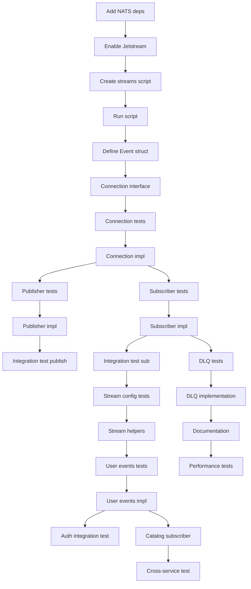

# Implementation Plan: NATS Jetstream Event System

**Created**: 2025-12-09
**Spec**: [spec.md](./spec.md)

## Technical Context

### Technologies & Tools
- **NATS**: 2.10+ with Jetstream enabled
- **Go Client**: github.com/nats-io/nats.go v1.31+
- **Event Format**: CloudEvents specification (JSON encoding)
- **Streams**: Persistent message logs per service
- **Consumers**: Durable subscriptions with position tracking
- **Delivery**: At-least-once delivery guarantee
- **Shared Package**: pkg/events for publisher/subscriber implementations

### Design Decisions
- **Stream per service**: AUTH_EVENTS, CATALOG_EVENTS, DDMRP_EVENTS, EXECUTION_EVENTS, ANALYTICS_EVENTS, AI_AGENT_EVENTS
- **Subject hierarchy**: "service.entity.action" (e.g., "auth.user.created", "catalog.product.updated")
- **Retention policy**: 7-day time limit, 1GB size limit per stream
- **Replication**: 1 replica for development, 3 replicas for production
- **Consumer groups**: For load balancing across service instances
- **Acknowledgment**: Manual ACK/NAK for at-least-once delivery
- **Retry strategy**: Max 3 retries with exponential backoff (1s, 2s, 4s)
- **Dead Letter Queue**: Move to "DLQ_EVENTS" stream after max retries
- **Multi-tenancy**: Include organization_id in every event for filtering

## Project Structure

```
pkg/events/
├── go.mod                           # Module definition (EXISTS - UPDATE)
├── event.go                         # CloudEvents-like structure (NEW)
├── publisher.go                     # Publisher interface and impl (NEW)
├── subscriber.go                    # Subscriber interface and impl (NEW)
├── connection.go                    # NATS connection management (NEW)
├── stream_config.go                 # Stream configuration (NEW)
├── consumer_config.go               # Consumer configuration (NEW)
├── publisher_test.go                # Unit tests (NEW)
├── subscriber_test.go               # Unit tests (NEW)
├── publisher_mock.go                # Mock for testing (NEW)
├── subscriber_mock.go               # Mock for testing (NEW)
├── README.md                        # Package documentation (NEW)
└── examples/
    ├── publisher_example.go         # Usage example (NEW)
    └── subscriber_example.go        # Usage example (NEW)

scripts/
├── setup-nats-streams.sh            # Initialize Jetstream streams (NEW)
└── test-nats-pubsub.go              # Integration test script (NEW)

services/auth-service/
├── internal/
│   ├── infrastructure/
│   │   └── events/
│   │       ├── publishers/
│   │       │   ├── user_events.go         # Publish user events (NEW)
│   │       │   └── auth_events.go         # Publish auth events (NEW)
│   │       │
│   │       └── subscribers/
│   │           └── example_subscriber.go  # Example event consumer (NEW)
│   │
│   └── core/
│       └── usecases/
│           └── events/
│               └── publish_user_created.go # Use case to publish event (NEW)

services/catalog-service/
└── internal/
    └── infrastructure/
        └── events/
            ├── publishers/
            │   └── catalog_events.go      # Publish catalog events (NEW)
            │
            └── subscribers/
                └── user_subscriber.go     # Subscribe to user events (NEW)

docs/
├── EVENTS.md                        # Event catalog documentation (NEW)
└── NATS_ARCHITECTURE.md             # NATS Jetstream architecture (NEW)
```

## Phased Implementation

### Phase 1: Setup (Foundation)
**Goal**: Install NATS, configure Jetstream, create streams

- **T001** [Setup]: Add NATS dependencies to `pkg/events/go.mod`:
  ```
  github.com/nats-io/nats.go v1.31.0
  github.com/google/uuid v1.5.0
  ```
- **T002** [Setup]: Update `docker-compose.yml` to enable Jetstream:
  ```yaml
  nats:
    image: nats:2-alpine
    ports:
      - "4222:4222"
      - "8222:8222"  # HTTP monitoring
    command:
      - "-js"  # Enable Jetstream
      - "-sd=/data"  # Storage directory
    volumes:
      - nats-data:/data
  ```
- **T003** [Setup]: Start NATS with Jetstream: `docker-compose up -d nats`
- **T004** [Setup]: Install NATS CLI for management: `go install github.com/nats-io/natscli/nats@latest`
- **T005** [Setup]: Create `scripts/setup-nats-streams.sh`:
  ```bash
  #!/bin/bash
  nats stream add AUTH_EVENTS \
    --subjects "auth.>" \
    --storage file \
    --retention limits \
    --max-age 7d \
    --max-bytes 1G \
    --replicas 1

  nats stream add CATALOG_EVENTS --subjects "catalog.>" ...
  nats stream add DDMRP_EVENTS --subjects "ddmrp.>" ...
  nats stream add EXECUTION_EVENTS --subjects "execution.>" ...
  nats stream add ANALYTICS_EVENTS --subjects "analytics.>" ...
  nats stream add AI_AGENT_EVENTS --subjects "ai_agent.>" ...
  nats stream add DLQ_EVENTS --subjects "dlq.>" ...
  ```
- **T006** [Setup]: Run stream creation script
- **T007** [Setup]: Verify streams created: `nats stream list`

**Checkpoint**: NATS Jetstream running with all streams configured

---

### Phase 2: Foundational - Event Structure (Blocking Prerequisites)
**Goal**: Define CloudEvents-like event structure

- **T008** [Foundational]: Create `pkg/events/event.go`:
  ```go
  package events

  import "time"

  type Event struct {
      ID             string                 `json:"id"`              // UUID
      Type           string                 `json:"type"`            // "user.created"
      Source         string                 `json:"source"`          // "auth-service"
      OrganizationID string                 `json:"organization_id"` // Multi-tenancy
      Timestamp      time.Time              `json:"timestamp"`       // RFC3339
      SchemaVersion  string                 `json:"schema_version"`  // "1.0"
      Data           map[string]interface{} `json:"data"`            // Payload
  }

  func NewEvent(eventType, source, orgID string, data map[string]interface{}) *Event {
      return &Event{
          ID:             uuid.New().String(),
          Type:           eventType,
          Source:         source,
          OrganizationID: orgID,
          Timestamp:      time.Now().UTC(),
          SchemaVersion:  "1.0",
          Data:           data,
      }
  }

  func (e *Event) Validate() error {
      if e.Type == "" {
          return errors.New("event type is required")
      }
      if e.Source == "" {
          return errors.New("event source is required")
      }
      if e.OrganizationID == "" {
          return errors.New("organization_id is required")
      }
      return nil
  }
  ```
- **T009** [Foundational]: Create connection interface `pkg/events/connection.go`:
  ```go
  type Connection interface {
      Connect(ctx context.Context, url string) error
      JetStream() (nats.JetStreamContext, error)
      Close() error
      IsConnected() bool
  }
  ```
- **T010** [Foundational]: Create publisher interface `pkg/events/publisher.go`:
  ```go
  type Publisher interface {
      Publish(ctx context.Context, event *Event) error
      PublishAsync(ctx context.Context, event *Event) error
      Close() error
  }
  ```
- **T011** [Foundational]: Create subscriber interface `pkg/events/subscriber.go`:
  ```go
  type Handler func(ctx context.Context, event *Event) error

  type Subscriber interface {
      Subscribe(ctx context.Context, subject string, handler Handler) error
      SubscribeWithGroup(ctx context.Context, subject, group string, handler Handler) error
      Unsubscribe() error
      Close() error
  }
  ```

**Checkpoint**: Event structure and interfaces defined

---

### Phase 3: User Story 1 - Domain Event Publishing (P1)
**Goal**: Implement event publisher with retry logic

- **T012** [P][US1]: Write test for NATS connection
- **T013** [US1]: Implement `pkg/events/connection.go`:
  ```go
  type NATSConnection struct {
      nc *nats.Conn
      js nats.JetStreamContext
      url string
      logger logger.Logger
  }

  func NewConnection(url string, logger logger.Logger) *NATSConnection {
      return &NATSConnection{url: url, logger: logger}
  }

  func (c *NATSConnection) Connect(ctx context.Context, url string) error {
      nc, err := nats.Connect(url,
          nats.MaxReconnects(10),
          nats.ReconnectWait(2*time.Second),
          nats.DisconnectErrHandler(c.handleDisconnect),
          nats.ReconnectHandler(c.handleReconnect),
      )
      if err != nil {
          return fmt.Errorf("failed to connect to NATS: %w", err)
      }

      js, err := nc.JetStream()
      if err != nil {
          nc.Close()
          return fmt.Errorf("failed to get JetStream context: %w", err)
      }

      c.nc = nc
      c.js = js
      return nil
  }
  ```
- **T014** [P][US1]: Write test for event publishing
- **T015** [US1]: Implement `pkg/events/publisher.go`:
  ```go
  type NATSPublisher struct {
      js     nats.JetStreamContext
      logger logger.Logger
  }

  func NewPublisher(conn Connection, logger logger.Logger) (*NATSPublisher, error) {
      js, err := conn.JetStream()
      if err != nil {
          return nil, err
      }
      return &NATSPublisher{js: js, logger: logger}, nil
  }

  func (p *NATSPublisher) Publish(ctx context.Context, event *Event) error {
      if err := event.Validate(); err != nil {
          return fmt.Errorf("invalid event: %w", err)
      }

      // Determine subject from event type
      subject := p.buildSubject(event)

      // Serialize event to JSON
      data, err := json.Marshal(event)
      if err != nil {
          return fmt.Errorf("failed to marshal event: %w", err)
      }

      // Publish with retry
      var lastErr error
      for attempt := 1; attempt <= 3; attempt++ {
          _, err := p.js.Publish(subject, data)
          if err == nil {
              p.logger.Info(ctx, "Event published", logs.Tags{
                  "event_id": event.ID,
                  "event_type": event.Type,
                  "subject": subject,
              })
              return nil
          }

          lastErr = err
          p.logger.Warn(ctx, "Publish failed, retrying", logs.Tags{
              "attempt": attempt,
              "error": err.Error(),
          })

          // Exponential backoff
          time.Sleep(time.Duration(attempt) * time.Second)
      }

      return fmt.Errorf("failed to publish after 3 attempts: %w", lastErr)
  }

  func (p *NATSPublisher) buildSubject(event *Event) string {
      // event.Type = "user.created" → subject = "auth.user.created"
      return fmt.Sprintf("%s.%s", event.Source, event.Type)
  }
  ```
- **T016** [P][US1]: Write test for publish retry logic (mock NATS failure)
- **T017** [US1]: Implement `PublishAsync()` for fire-and-forget publishing:
  ```go
  func (p *NATSPublisher) PublishAsync(ctx context.Context, event *Event) error {
      go func() {
          if err := p.Publish(context.Background(), event); err != nil {
              p.logger.Error(ctx, err, "Async publish failed", logs.Tags{
                  "event_id": event.ID,
              })
          }
      }()
      return nil
  }
  ```
- **T018** [US1]: Create stream configuration helper `pkg/events/stream_config.go`:
  ```go
  func GetStreamConfig(streamName string) *nats.StreamConfig {
      return &nats.StreamConfig{
          Name:       streamName,
          Subjects:   []string{strings.ToLower(strings.TrimSuffix(streamName, "_EVENTS")) + ".>"},
          Storage:    nats.FileStorage,
          Retention:  nats.LimitsPolicy,
          MaxAge:     7 * 24 * time.Hour,
          MaxBytes:   1024 * 1024 * 1024, // 1GB
          Replicas:   1,
      }
  }
  ```
- **T019** [P][US1]: Write integration test: Publish event, verify it's in stream
- **T020** [US1]: Test with NATS CLI: `nats stream view AUTH_EVENTS`

**Checkpoint**: Events can be published to Jetstream with retry logic

---

### Phase 4: User Story 2 - Event Subscription (P1)
**Goal**: Implement durable subscriber with at-least-once delivery

- **T021** [P][US2]: Write test for event subscription
- **T022** [US2]: Implement `pkg/events/subscriber.go`:
  ```go
  type NATSSubscriber struct {
      js          nats.JetStreamContext
      subscription *nats.Subscription
      logger      logger.Logger
  }

  func NewSubscriber(conn Connection, logger logger.Logger) (*NATSSubscriber, error) {
      js, err := conn.JetStream()
      if err != nil {
          return nil, err
      }
      return &NATSSubscriber{js: js, logger: logger}, nil
  }

  func (s *NATSSubscriber) Subscribe(ctx context.Context, subject string, handler Handler) error {
      return s.SubscribeWithGroup(ctx, subject, "default", handler)
  }

  func (s *NATSSubscriber) SubscribeWithGroup(ctx context.Context, subject, group string, handler Handler) error {
      // Create durable consumer
      sub, err := s.js.Subscribe(subject, s.wrapHandler(handler),
          nats.Durable(group),
          nats.ManualAck(),
          nats.AckWait(30*time.Second),
          nats.MaxDeliver(5),  // Max retry attempts
      )
      if err != nil {
          return fmt.Errorf("failed to subscribe: %w", err)
      }

      s.subscription = sub
      s.logger.Info(ctx, "Subscribed to subject", logs.Tags{
          "subject": subject,
          "group": group,
      })

      return nil
  }

  func (s *NATSSubscriber) wrapHandler(handler Handler) nats.MsgHandler {
      return func(msg *nats.Msg) {
          ctx := context.Background()

          // Deserialize event
          var event Event
          if err := json.Unmarshal(msg.Data, &event); err != nil {
              s.logger.Error(ctx, err, "Failed to unmarshal event")
              msg.Nak()
              return
          }

          // Log event receipt
          s.logger.Info(ctx, "Processing event", logs.Tags{
              "event_id": event.ID,
              "event_type": event.Type,
          })

          // Call handler
          if err := handler(ctx, &event); err != nil {
              s.logger.Error(ctx, err, "Handler failed", logs.Tags{
                  "event_id": event.ID,
              })
              msg.Nak()
              return
          }

          // Acknowledge successful processing
          msg.Ack()
          s.logger.Info(ctx, "Event processed successfully", logs.Tags{
              "event_id": event.ID,
          })
      }
  }
  ```
- **T023** [P][US2]: Write test for at-least-once delivery (simulate handler failure)
- **T024** [US2]: Verify event redelivered after NAK
- **T025** [P][US2]: Write test for consumer group load balancing
- **T026** [US2]: Start 2 subscriber instances, publish 10 events, verify load distribution
- **T027** [US2]: Implement graceful shutdown:
  ```go
  func (s *NATSSubscriber) Close() error {
      if s.subscription != nil {
          return s.subscription.Drain()
      }
      return nil
  }
  ```
- **T028** [P][US2]: Write integration test: Full pub/sub flow with real NATS

**Checkpoint**: Subscribers can consume events with at-least-once delivery

---

### Phase 5: User Story 3 - Stream Configuration (P2)
**Goal**: Configure retention policies and consumer settings

- **T029** [P][US3]: Write test for stream creation with custom retention
- **T030** [US3]: Implement `pkg/events/stream_config.go` helpers:
  ```go
  func CreateStream(js nats.JetStreamContext, config *nats.StreamConfig) error {
      _, err := js.AddStream(config)
      if err != nil {
          return fmt.Errorf("failed to create stream: %w", err)
      }
      return nil
  }

  func UpdateStream(js nats.JetStreamContext, config *nats.StreamConfig) error {
      _, err := js.UpdateStream(config)
      if err != nil {
          return fmt.Errorf("failed to update stream: %w", err)
      }
      return nil
  }

  func DeleteStream(js nats.JetStreamContext, streamName string) error {
      return js.DeleteStream(streamName)
  }

  func GetStreamInfo(js nats.JetStreamContext, streamName string) (*nats.StreamInfo, error) {
      return js.StreamInfo(streamName)
  }
  ```
- **T031** [US3]: Create consumer configuration helper `pkg/events/consumer_config.go`:
  ```go
  func CreateConsumer(js nats.JetStreamContext, streamName, consumerName string, config *nats.ConsumerConfig) error {
      _, err := js.AddConsumer(streamName, config)
      return err
  }

  func GetDefaultConsumerConfig(consumerName string) *nats.ConsumerConfig {
      return &nats.ConsumerConfig{
          Durable:       consumerName,
          AckPolicy:     nats.AckExplicitPolicy,
          AckWait:       30 * time.Second,
          MaxDeliver:    5,
          FilterSubject: "",
      }
  }
  ```
- **T032** [P][US3]: Write test for stream retention (time-based)
- **T033** [US3]: Verify events deleted after 7 days (simulate with short TTL in test)
- **T034** [P][US3]: Write test for stream size limit
- **T035** [US3]: Verify oldest events deleted when stream reaches 1GB
- **T036** [US3]: Update `scripts/setup-nats-streams.sh` to use code-based stream creation
- **T037** [US3]: Document stream configuration in `docs/NATS_ARCHITECTURE.md`

**Checkpoint**: Streams configured with retention policies and consumer settings

---

### Phase 6: Auth Service Integration (Example Implementation)
**Goal**: Integrate event publishing into Auth service

- **T038** [P]: Write test for user.created event publishing
- **T039**: Implement `services/auth-service/internal/infrastructure/events/publishers/user_events.go`:
  ```go
  type UserEventPublisher struct {
      publisher events.Publisher
      logger    logger.Logger
  }

  func (p *UserEventPublisher) PublishUserCreated(ctx context.Context, user *domain.User) error {
      event := events.NewEvent(
          "user.created",
          "auth-service",
          user.OrganizationID,
          map[string]interface{}{
              "user_id": user.ID,
              "email":   user.Email,
              "name":    user.Name,
              "status":  user.Status,
          },
      )

      return p.publisher.Publish(ctx, event)
  }

  func (p *UserEventPublisher) PublishUserUpdated(ctx context.Context, user *domain.User) error {
      event := events.NewEvent(
          "user.updated",
          "auth-service",
          user.OrganizationID,
          map[string]interface{}{
              "user_id": user.ID,
              "email":   user.Email,
              "name":    user.Name,
          },
      )

      return p.publisher.Publish(ctx, event)
  }
  ```
- **T040**: Update register use case to publish user.created event:
  ```go
  func (uc *RegisterUseCase) Execute(ctx context.Context, req *RegisterRequest) error {
      // ... create user logic ...

      // Publish event
      if err := uc.eventPublisher.PublishUserCreated(ctx, user); err != nil {
          uc.logger.Warn(ctx, "Failed to publish user.created event", logs.Tags{
              "user_id": user.ID,
              "error": err.Error(),
          })
          // Don't fail the operation if event publishing fails
      }

      return nil
  }
  ```
- **T041**: Implement auth event publisher for login, logout, password reset events
- **T042** [P]: Write integration test: Register user → verify event published to AUTH_EVENTS stream
- **T043**: Add event publishing to update user, delete user, role assignment use cases

**Checkpoint**: Auth service publishes events for all domain operations

---

### Phase 7: Catalog Service Subscriber (Example Implementation)
**Goal**: Subscribe to auth events from Catalog service

- **T044**: Create `services/catalog-service/internal/infrastructure/events/subscribers/user_subscriber.go`:
  ```go
  type UserEventSubscriber struct {
      subscriber   events.Subscriber
      userUseCase  usecases.SyncUserUseCase
      logger       logger.Logger
  }

  func (s *UserEventSubscriber) Start(ctx context.Context) error {
      return s.subscriber.SubscribeWithGroup(ctx, "auth.user.*", "catalog-service", s.handleUserEvent)
  }

  func (s *UserEventSubscriber) handleUserEvent(ctx context.Context, event *events.Event) error {
      switch event.Type {
      case "user.created":
          return s.handleUserCreated(ctx, event)
      case "user.updated":
          return s.handleUserUpdated(ctx, event)
      case "user.deleted":
          return s.handleUserDeleted(ctx, event)
      default:
          s.logger.Warn(ctx, "Unknown event type", logs.Tags{"type": event.Type})
          return nil
      }
  }

  func (s *UserEventSubscriber) handleUserCreated(ctx context.Context, event *events.Event) error {
      userID := event.Data["user_id"].(string)
      email := event.Data["email"].(string)

      s.logger.Info(ctx, "User created event received", logs.Tags{
          "user_id": userID,
          "email": email,
      })

      // Sync user data to local cache or database
      return s.userUseCase.SyncUser(ctx, userID, email)
  }
  ```
- **T045**: Start subscriber in Catalog service main.go:
  ```go
  // Create subscriber
  subscriber := userSubscriber.NewUserEventSubscriber(...)
  if err := subscriber.Start(ctx); err != nil {
      logger.Fatal(ctx, err, "Failed to start event subscriber")
  }
  ```
- **T046** [P]: Write integration test: Publish user.created from Auth → verify Catalog receives it
- **T047**: Document event flow in `docs/EVENTS.md`:
  - List all event types
  - Document event schemas
  - Show event flow diagrams
  - Provide subscription examples

**Checkpoint**: Catalog service can subscribe to Auth events

---

### Phase 8: User Story 4 - Dead Letter Queue (P3)
**Goal**: Handle failed events with DLQ

- **T048** [P][US4]: Write test for max retry exceeded
- **T049** [US4]: Update subscriber to move events to DLQ after 5 failures:
  ```go
  func (s *NATSSubscriber) wrapHandler(handler Handler) nats.MsgHandler {
      return func(msg *nats.Msg) {
          // ... existing code ...

          // Check delivery count
          metadata, _ := msg.Metadata()
          if metadata.NumDelivered >= 5 {
              s.logger.Error(ctx, nil, "Max delivery attempts reached, moving to DLQ", logs.Tags{
                  "event_id": event.ID,
              })
              s.moveToDeadLetterQueue(msg, &event)
              msg.Ack()  // Prevent further redelivery
              return
          }

          // ... existing handler logic ...
      }
  }

  func (s *NATSSubscriber) moveToDeadLetterQueue(msg *nats.Msg, event *Event) error {
      dlqEvent := events.NewEvent(
          "dlq."+event.Type,
          event.Source,
          event.OrganizationID,
          map[string]interface{}{
              "original_event": event,
              "failure_reason": "max retries exceeded",
              "original_subject": msg.Subject,
          },
      )

      data, _ := json.Marshal(dlqEvent)
      _, err := s.js.Publish("dlq.events", data)
      return err
  }
  ```
- **T050** [US4]: Create DLQ monitoring endpoint `GET /api/v1/events/dlq` (admin only)
- **T051** [US4]: Implement DLQ replay functionality (move event back to original stream)
- **T052** [P][US4]: Write integration test: Force event failure 5 times, verify moved to DLQ

**Checkpoint**: Failed events moved to DLQ after max retries

---

### Phase 9: Polish (Documentation and Monitoring)
**Goal**: Production-ready event system

- **T053** [Polish]: Create `pkg/events/README.md`:
  - Package overview
  - Publisher usage examples
  - Subscriber usage examples
  - Error handling best practices
  - Performance tips
- **T054** [Polish]: Create `docs/EVENTS.md` event catalog:
  ```markdown
  # Event Catalog

  ## Auth Events (auth.*)
  - auth.user.created
  - auth.user.updated
  - auth.user.deleted
  - auth.role.assigned
  - auth.login.succeeded
  - auth.login.failed

  ## Catalog Events (catalog.*)
  - catalog.product.created
  - catalog.product.updated
  - catalog.supplier.created
  ```
- **T055** [Polish]: Create Mermaid diagrams for event flows
- **T056** [Polish]: Add metrics for event publishing:
  - Counter: events_published_total (labels: event_type, status)
  - Histogram: event_publish_duration_seconds
  - Counter: events_consumed_total (labels: event_type, status)
- **T057** [Polish]: Add metrics for subscriber processing:
  - Histogram: event_handler_duration_seconds
  - Counter: event_handler_errors_total
  - Gauge: subscription_lag (events pending)
- **T058** [Polish]: Implement event replay functionality:
  ```go
  func ReplayEvents(js nats.JetStreamContext, streamName string, from time.Time, to time.Time) error {
      // Create temporary consumer starting at timestamp
      // Replay events to handler
  }
  ```
- **T059** [Polish]: Create `scripts/test-nats-pubsub.go` for manual testing:
  ```go
  // Publish 100 events
  // Subscribe and consume
  // Verify all delivered
  ```
- **T060** [Polish]: Benchmark event throughput:
  - Target: 10,000 events/second published
  - Target: 1,000 events/second consumed per instance
- **T061** [Polish]: Load test: Publish 100,000 events, verify all delivered
- **T062** [Polish]: Test graceful shutdown (drain in-flight messages)
- **T063** [Polish]: Handle edge case: NATS unavailable during publish
  - Fall back to logging error
  - Continue operation (events are fire-and-forget)
- **T064** [Polish]: Handle edge case: Subscriber falls behind
  - Monitor subscription lag
  - Alert if lag > 1000 messages
  - Scale horizontally with consumer groups
- **T065** [Polish]: Implement idempotency helper for handlers:
  ```go
  func IdempotentHandler(key string, handler Handler) Handler {
      return func(ctx context.Context, event *Event) error {
          // Check Redis if event already processed
          // Process if not
          // Mark as processed in Redis
      }
  }
  ```
- **T066** [Polish]: Document event versioning strategy (schema evolution)
- **T067** [Polish]: Run golangci-lint on pkg/events
- **T068** [Polish]: Generate test coverage report (>80%)
- **T069** [Polish]: Create Grafana dashboard for NATS metrics
- **T070** [Polish]: Update main README with event system overview

**Checkpoint**: Event system production-ready with monitoring and documentation

---

## Task Dependencies



**Critical Path**: T001 → T006 → T013 → T015 → T022 → T039 → T053

## Execution Strategy

### Recommended Order (Single Developer)
**Week 1: Foundation**
- Day 1: Phase 1-2 (Setup + Event structure)
- Day 2-3: Phase 3 (Publisher implementation)
- Day 4-5: Phase 4 (Subscriber implementation)

**Week 2: Integration**
- Day 1: Phase 5 (Stream configuration)
- Day 2: Phase 6 (Auth service integration)
- Day 3: Phase 7 (Catalog subscriber example)
- Day 4: Phase 8 (Dead letter queue)
- Day 5: Phase 9 (Documentation and monitoring)

### Team of 2 Developers
**Week 1**
- Dev A: Phase 1-3 (Setup + Publisher)
- Dev B: Phase 4-5 (Subscriber + Stream config)

**Week 2**
- Dev A: Phase 6-7 (Service integration)
- Dev B: Phase 8-9 (DLQ + Polish)

**Total: 8-10 days single developer, 6-7 days with 2 developers**

## Testing Strategy

### Unit Testing
- Mock NATS connection for publisher/subscriber tests
- Test retry logic with simulated failures
- Test event validation
- Target: >80% coverage

### Integration Testing
- Test with real NATS Jetstream (docker-compose)
- Test pub/sub flow end-to-end
- Test at-least-once delivery guarantee
- Test consumer group load balancing

### Performance Testing
- Benchmark publish throughput: 10,000 events/second
- Benchmark subscribe throughput: 1,000 events/second per instance
- Measure end-to-end latency: <100ms (p95)
- Load test: 100,000 events published and consumed

### Manual Testing Checklist
- [ ] Events published appear in NATS stream
- [ ] Subscribers receive events
- [ ] Events redelivered after NAK
- [ ] Consumer group distributes load
- [ ] DLQ receives failed events after max retries
- [ ] Graceful shutdown drains in-flight messages
- [ ] Metrics recorded for all operations
- [ ] Stream retention works (events deleted after 7 days)

## Risks & Mitigations

| Risk | Impact | Mitigation |
|------|--------|------------|
| NATS unavailable during publish | Medium | Fall back to logging, continue operation, don't block critical paths |
| Event schema changes break consumers | High | Version events (schema_version field), maintain backward compatibility |
| Subscriber falls behind (lag) | Medium | Monitor lag metrics, scale horizontally with consumer groups, increase resources |
| Duplicate event processing | Medium | Implement idempotency in handlers, use event ID for deduplication |
| DLQ fills up with failures | Low | Alert on DLQ size, investigate root cause, implement DLQ cleanup policy |
| Message size exceeds limits | Low | Compress large payloads, split into multiple events, reference external storage |

## Rollout Plan

1. **PR 1**: Foundation (Phase 1-2) - NATS setup, event structure, interfaces
2. **PR 2**: Publisher (Phase 3) - Event publishing with retry
3. **PR 3**: Subscriber (Phase 4) - Event consumption with at-least-once delivery
4. **PR 4**: Configuration (Phase 5) - Stream and consumer management
5. **PR 5**: Integration (Phase 6-7) - Auth and Catalog service examples
6. **PR 6**: DLQ (Phase 8) - Dead letter queue handling
7. **PR 7**: Polish (Phase 9) - Documentation, monitoring, optimization

Each PR independently deployable to staging.

---

**Estimated Effort**: 8-10 days (single developer), 6-7 days (team of 2)
**Complexity**: Medium (distributed system + at-least-once delivery)
**Blockers**: Task 3 (local infrastructure), Task 4 (shared packages for events)
**Enables**: All services (event-driven communication), Task 9 (Catalog can subscribe to Auth events)
